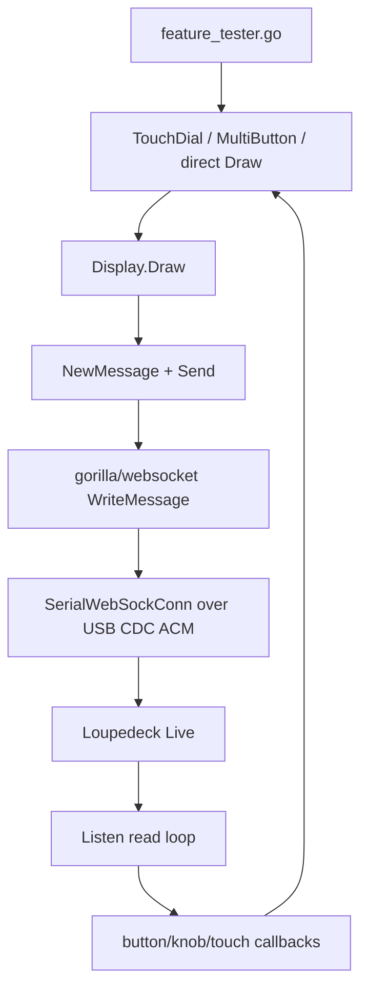
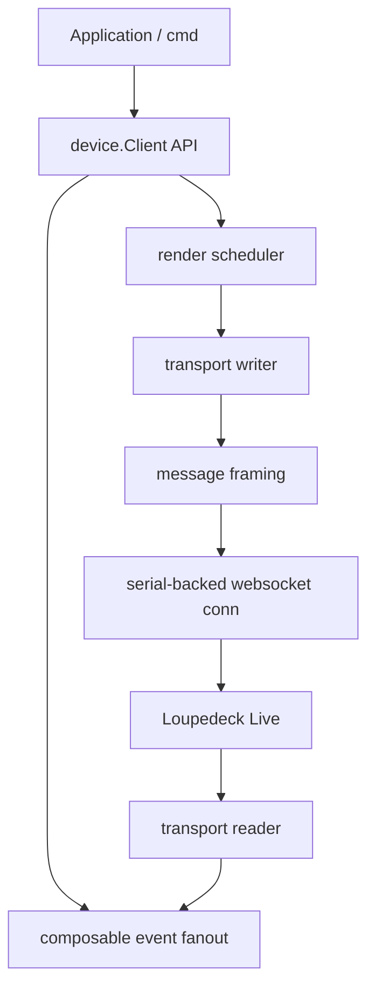

# go-go-golems loupedeck package: backpressure-safe architecture and implementation guide

## Executive summary

This document explains how to evolve the current Loupedeck Live experiments into a real package published as `github.com/go-go-golems/loupedeck`, with a deliberate focus on backpressure and transport stability. The immediate goal is not to build every ideal subsystem at once. The goal is to establish a package architecture that stops the current draw storms, preserves composability, and gives us enough instrumentation to decide whether a stricter send discipline is necessary later.

The current prototype proved that the hardware is usable and that the existing `github.com/scottlaird/loupedeck` library is capable of talking to the device over USB serial using a WebSocket-like protocol. It also proved something equally important: the current drawing and callback model is too eager. It sends framebuffer writes immediately, performs no pacing, exposes no queueing or coalescing abstraction, panics on malformed reads, and allows only one callback per button/knob/touch input. Those behaviors are acceptable for a small demo, but they are the wrong defaults for a package that is expected to survive bursty updates, multiple widgets, and repeated runs on real hardware.

The recommended plan is:

1. **B-lite first**: fork the implementation into a real top-level package, add safe lifecycle handling, add composable event listeners, and introduce a single outbound writer/scheduler so all sends are serialized and paced.
2. **Then full B**: move from command pacing to actual render scheduling with dirty-region coalescing, widget invalidation, and display-state ownership inside the package.
3. **Only then evaluate C**: if the paced/coalesced design is still not sufficient, add stricter "one draw in flight" or ack-gated flow control.

This sequence minimizes risk. It avoids overengineering before we have package-level control, but it also stops us from repeating the current pattern of spreading `time.Sleep()` calls across application code.

---

## Problem statement and scope

The problem is not simply “the Loupedeck crashes unless we sleep between draws.” That symptom is real, but it is a consequence of deeper architectural issues in the current stack.

At a high level, the current system has four important characteristics:

1. **Every draw is sent immediately**.
2. **Widgets redraw themselves directly from event callbacks/watchers**.
3. **Input bindings are single-slot, not composable**.
4. **Transport errors cause panics and poor cleanup**.

Those four properties interact badly. A burst of widget redraws becomes a burst of `WriteFramebuff` and `Draw` messages. Because each draw goes out immediately and because the transport layer has no pacing, batching, or coalescing, the device appears to get into a malformed protocol state. The websocket implementation then reports errors such as bad opcodes or malformed control frames, and the library panics instead of recovering. On top of that, the single-callback binding model makes it easy for application code to overwrite widget behavior accidentally, which makes debugging transport behavior harder than it needs to be.

### In scope

This ticket is about the architecture and implementation plan for a package-level fix. It covers:

- the current code structure and runtime behavior,
- the failure modes we have observed,
- the phased design for a new `github.com/go-go-golems/loupedeck` package,
- the B-lite and B implementation plans,
- the decision criteria for possibly adopting C later.

### Out of scope

This ticket does **not** attempt to solve every possible Loupedeck feature or every device model immediately. In particular, the following are out of scope for the first implementation wave:

- perfect support for all Loupedeck models,
- a full custom websocket parser,
- animations and high-FPS visual effects,
- advanced editor tooling or a polished example suite.

Those may become follow-up tickets once the transport and render model is sound.

---

## Current-state architecture and evidence

This section explains what exists today, where it lives, and why it behaves the way it does.

### Repository shape today

At the time of writing, the repository does **not** yet contain a top-level Go module for the new package. The current module declarations are only in the ticket-specific scripts:

- `ttmp/2026/04/11/LOUPE-001--.../scripts/go.mod`
- `ttmp/2026/04/11/LOUPE-002--.../scripts/go.mod`

Evidence:

```bash
rg -n '^module ' -S .
```

Observed result:

- `module loupedeck-hello-world`
- `module loupedeck-feature-tester`

This matters because the current work is still organized as experiments around a cloned upstream dependency rather than as the beginning of a maintained package.

### Current implementation surface

The upstream cloned library under `sources/loupedeck-repo/` is small enough to reason about as a single system. Key file sizes:

| File | Approx lines | Purpose |
|------|--------------|---------|
| `connect.go` | 155 | connect and handshake |
| `dialer.go` | 123 | serial-backed `net.Conn` bridge |
| `display.go` | 177 | image encoding and display writes |
| `inputs.go` | 208 | enums and callback binding |
| `intknob.go` | 83 | knob-to-integer helper |
| `listen.go` | 115 | read loop and callback dispatch |
| `loupedeck.go` | 196 | root struct, text helper, button color |
| `message.go` | 179 | protocol message framing and send logic |
| `multibutton.go` | 135 | touch-button widget |
| `touchdials.go` | 145 | knob-strip widget |
| `watchedint.go` | 59 | observable integer state |

Total: about **1575 lines** of Go.

This is good news for the refactor: the package is conceptually dense, but not huge.

### Runtime flow today

The current runtime architecture is roughly this:



The important detail is that the path from widget state change to transport write is immediate. There is no intermediate scheduler, queue, renderer, or pacing layer.

### Evidence: every draw sends immediately

The central draw path is in `sources/loupedeck-repo/display.go:113-176`.

Observed behavior:

1. Build a framebuffer payload from the image.
2. Send a `WriteFramebuff` message.
3. Immediately send a `Draw` message.

Relevant code shape:

```go
m := d.loupedeck.NewMessage(WriteFramebuff, data)
err := d.loupedeck.Send(m)
...
m2 := d.loupedeck.NewMessage(Draw, data2)
err = d.loupedeck.Send(m2)
```

There is no queueing, no coalescing, and no check for in-flight draws. The comment in the file already hints at the missing abstraction:

> Ideally, we'd batch these and only call Draw when we're done with multiple FB updates.

That is exactly the direction this ticket formalizes.

### Evidence: widgets redraw from watchers and touch handlers

#### `TouchDial`

In `sources/loupedeck-repo/touchdials.go:98-101`, each watched integer adds a redraw callback:

```go
touchdial.w1.AddWatcher(func(i int) { touchdial.Draw() })
touchdial.w2.AddWatcher(func(i int) { touchdial.Draw() })
touchdial.w3.AddWatcher(func(i int) { touchdial.Draw() })
```

And `TouchDial.Draw()` redraws the full 60×270 strip in `touchdials.go:129-145`.

That means a drag on the touch strip or a fast series of knob increments can cause repeated full-strip redraws.

#### `MultiButton`

In `sources/loupedeck-repo/multibutton.go:88-96`, a watched integer redraws immediately and touch input advances immediately:

```go
watchedint.AddWatcher(func(i int) {
    m.Draw()
})

l.BindTouch(b, func(a TouchButton, b ButtonStatus, c uint16, d uint16) {
    m.Advance()
})
```

Again, there is no invalidation layer between state change and transport write.

### Evidence: bindings are single-slot and therefore non-composable

In `sources/loupedeck-repo/inputs.go:173-207`, each bind function writes directly into a single map slot:

```go
func (l *Loupedeck) BindKnob(k Knob, f KnobFunc) {
    l.knobBindings[k] = f
}

func (l *Loupedeck) BindTouch(b TouchButton, f TouchFunc) {
    l.touchBindings[b] = f
}
```

This means “last bind wins.” There is no listener fanout.

This is a major design constraint because several current abstractions assume they can own the handler for a button or knob:

- `IntKnob()` binds knob rotation and knob-press reset in `intknob.go:67-82`
- `NewTouchDial()` creates `IntKnob`s internally in `touchdials.go:75-77`
- `NewMultiButton()` binds touch behavior in `multibutton.go:92-94`

If the application later binds the same knob or touch button for logging or flashing, one behavior will overwrite the other.

### Evidence: the current feature tester already collides with this model

In `ttmp/.../LOUPE-002.../scripts/feature_tester.go`, the application sets up TouchDials and MultiButtons, then later binds knobs and touches again.

Relevant sections:

- `feature_tester.go:155-165` — create TouchDials
- `feature_tester.go:167-225` — create MultiButtons and bind touches again
- `feature_tester.go:232-254` — bind knobs for delta logging
- `feature_tester.go:295-312` — bind knobs again for logging
- `feature_tester.go:317-322` — bind Circle for exit

This is an important lesson for the refactor. Even if transport pacing were perfect, the current event model would still be fragile because widgets and app code are competing for the same handler slots.

### Evidence: transport errors panic instead of degrading gracefully

In `sources/loupedeck-repo/listen.go:17-20`, any read error becomes a panic:

```go
if err != nil {
    slog.Warn("Read error, exiting", "error", err)
    panic("Websocket connection failed")
}
```

For a demo, that is tolerable. For a reusable package, it is not. A package must surface errors in a recoverable way.

### Evidence: serial close is incomplete

In `sources/loupedeck-repo/dialer.go:42-44`, `Close()` returns without closing the underlying serial port:

```go
func (l *SerialWebSockConn) Close() error {
    return nil // l.Port.Close()
}
```

This likely contributes to poor behavior after crashes or abrupt exits.

### Evidence: send path has no pacing and no writer ownership

In `sources/loupedeck-repo/message.go:119-141`, `Send()` and `SendWithCallback()` call `l.conn.WriteMessage(...)` directly.

```go
func (l *Loupedeck) send(m *Message) error {
    b := m.asBytes()
    return l.conn.WriteMessage(websocket.BinaryMessage, b)
}
```

Any part of the package that reaches `Send()` can write immediately. There is no single transport owner responsible for ordering, pacing, accounting, or backpressure.

---

## Why the current design fails under load

A new engineer should understand that the issue is not mysterious. The current design has a predictable failure mode.

### The core mechanism

A burst of UI activity translates into a burst of framebuffer writes. The device speaks a serial-backed WebSocket-like protocol and appears to have limited tolerance for dense, back-to-back display traffic. The library sends every update immediately and assumes the device can absorb it. When the device cannot keep up cleanly, the read side sees malformed or unexpected frames. Because the read loop panics on error, a transient transport problem becomes a full application crash.

### Draw amplification examples

#### Startup amplification

In the current feature tester, startup creates:

- 2 TouchDial strips,
- 12 MultiButtons,
- additional flash behavior for touch interactions.

Approximate payload sizes:

- 90×90 icon tile = `90 * 90 * 2 = 16,200` bytes of RGB565 payload, plus protocol bytes.
- 60×270 TouchDial strip = `60 * 270 * 2 = 32,400` bytes, plus protocol bytes.

Rough startup total just for display payloads:

- 12 tiles ≈ 194 KB
- 2 strips ≈ 65 KB
- total ≈ 259 KB

That is a meaningful burst for an embedded serial-backed display path.

#### Runtime amplification

A single logical user action may trigger multiple physical writes:

- touch press → flash tile
- touch state change → MultiButton redraw
- touch release → restore tile
- knob drag → watched int updates → repeated full-strip redraws

Because these are not coalesced, the transport sees a series of overlapping intents instead of a compact expression of the final desired state.

### The callback model makes the situation worse

Because there is only one callback per input, debugging becomes confusing:

- adding logging can accidentally remove widget behavior,
- adding flash behavior can accidentally remove state changes,
- adding exit behavior to Circle can accidentally replace color-cycle behavior.

The result is that the system is both overloaded and difficult to reason about.

---

## Goals and non-goals for the new package

### Primary goals

The new `github.com/go-go-golems/loupedeck` package should:

1. provide a stable transport abstraction for Loupedeck Live serial/WebSocket communication,
2. serialize and pace outbound traffic,
3. make event subscription composable,
4. expose recoverable errors rather than panicking,
5. support widgets without requiring them to own direct transport writes,
6. provide enough instrumentation to debug rate, queue depth, and coalescing,
7. make it straightforward to build example applications in the repository root.

### Secondary goals

1. preserve useful abstractions such as WatchedInt, TouchDial-like strips, and MultiButton-like tiles,
2. keep the package understandable to small-team maintainers,
3. make room for multiple device models later without overcomplicating phase 1.

### Non-goals for B-lite

B-lite is intentionally not the final architecture. It does **not** need to solve:

- general-purpose animation engines,
- a full retained-mode scene graph,
- protocol-perfect ack semantics,
- every device family’s special-case rendering path.

---

## Proposed target architecture

This section describes the desired package shape after B-lite and after full B.

## Package layout proposal

At the repository top level, create a real module:

```text
/home/manuel/code/wesen/2026-04-11--loupedeck-test/
  go.mod                       # module github.com/go-go-golems/loupedeck
  README.md
  cmd/
    loupe-feature-tester/
      main.go
  pkg/                         # optional; use if team prefers pkg layout
  internal/                    # optional for protocol details if desired
  transport/
    serialws.go
    writer.go
    reader.go
  protocol/
    message.go
    types.go
    display.go
  device/
    client.go
    displays.go
    inputs.go
    lifecycle.go
  render/
    scheduler.go
    regions.go
    stats.go
  widgets/
    watchedint.go
    intknob.go
    multibutton.go
    touchdial.go
  examples/
    hello-world/
    feature-tester/
  docs/ or ttmp/               # ticket docs remain under ttmp
```

This exact directory breakdown can be simplified if the team prefers a flatter package. The most important boundaries are conceptual rather than cosmetic.

## Conceptual layers



### Layer responsibilities

#### 1. Transport layer

Responsible for:

- establishing the serial-backed WebSocket connection,
- owning the read loop and write loop,
- surfacing errors without panicking,
- ensuring only one writer sends outbound frames.

#### 2. Protocol layer

Responsible for:

- message framing and parsing,
- transaction IDs,
- device command constants,
- translating wire data into typed events.

#### 3. Device/client layer

Responsible for:

- device lifecycle and setup,
- display configuration,
- public user-facing methods,
- event registration and dispatch,
- bridging between app intents and the render/transport layers.

#### 4. Render layer

Responsible for:

- accepting draw intents,
- coalescing redundant updates,
- pacing flushes,
- keeping stats.

#### 5. Widget layer

Responsible for:

- UI logic and state transitions,
- generating draw invalidations,
- subscribing to events through fanout,
- never bypassing the render layer for raw transport writes.

---

## Phase plan: B-lite first, then B, then evaluate C

## Phase 1: B-lite

B-lite is the minimum package-level architecture that meaningfully fixes the current failure mode.

### B-lite objectives

1. create the real top-level module,
2. fork/port the current implementation into our namespace,
3. replace panic-based failure with returned errors and lifecycle signals,
4. replace single-slot bindings with multi-listener fanout,
5. add a single outbound writer goroutine,
6. add basic pacing between outbound commands,
7. centralize metrics and logging around outbound traffic.

### B-lite design in plain language

The simplest clean rule is: **all outbound messages must pass through one owned queue**. Nothing in widgets or displays should call `conn.WriteMessage()` directly. Instead, code submits an outbound command to a writer component. That component serializes messages and enforces a pacing interval.

This does not yet require full render coalescing. It is acceptable for B-lite if the unit of scheduling is still “message” or “draw request,” as long as:

- writes are serialized,
- pacing is centralized,
- sleeps disappear from app code,
- we can observe queue depth and send rate.

### B-lite public API sketch

```go
type Client struct {
    ...
}

type Options struct {
    PortPath          string
    SendInterval      time.Duration   // e.g. 25-100ms, configurable
    WriterQueueSize   int
    Logger            *slog.Logger
}

func Connect(ctx context.Context, opts Options) (*Client, error)
func (c *Client) Close() error
func (c *Client) Run(ctx context.Context) error
```

For sending:

```go
type OutboundCommand interface {
    Key() string          // optional stable identifier for stats/coalescing later
    Encode() ([]*protocol.Message, error)
    Kind() string
}

func (c *Client) Enqueue(cmd OutboundCommand) error
```

For events:

```go
type Subscription interface { Close() error }

func (c *Client) OnButton(btn Button, fn ButtonFunc) Subscription
func (c *Client) OnKnob(knob Knob, fn KnobFunc) Subscription
func (c *Client) OnTouch(t TouchButton, fn TouchFunc) Subscription
```

This replaces overwriting binds with listener registration.

### B-lite writer pseudocode

```go
func writerLoop(ctx context.Context, conn Conn, in <-chan OutboundCommand, interval time.Duration) error {
    ticker := time.NewTicker(interval)
    defer ticker.Stop()

    var queue []OutboundCommand

    for {
        select {
        case <-ctx.Done():
            return ctx.Err()

        case cmd := <-in:
            queue = append(queue, cmd)

        case <-ticker.C:
            if len(queue) == 0 {
                continue
            }

            cmd := queue[0]
            queue = queue[1:]

            msgs, err := cmd.Encode()
            if err != nil {
                recordEncodeError(cmd, err)
                continue
            }

            for _, m := range msgs {
                if err := conn.Write(m); err != nil {
                    return err
                }
            }

            recordSent(cmd)
        }
    }
}
```

This is intentionally simple. Its main virtue is that it creates a single place where pacing lives.

### Why B-lite is the correct first move

B-lite addresses the actual architectural deficiencies without requiring a full render rewrite on day one. It removes the two most dangerous patterns immediately:

- direct unpaced writes from arbitrary call sites,
- callback overwrites caused by single-slot bind maps.

That gives us a package we can use, test, and extend.

---

## Phase 2: full B

Once B-lite is working, the next step is to stop treating every draw as an equally urgent immediate command.

### Full B objectives

1. move from command pacing to render scheduling,
2. coalesce multiple invalidations for the same display region,
3. separate widget state from transport writes,
4. keep only the latest desired visual state for a region until flush time,
5. flush on a configurable cadence.

### The key insight

The device does not need every intermediate state. It needs a stable stream of final visual intents at a rate it can handle.

Examples:

- if Touch5 flashes red and then immediately restores its icon before the next flush, only the final intended image needs to go out,
- if a knob value changes from 128 → 129 → 130 → 131 in a short burst, the user usually only needs to see the latest visible state at flush time.

### Full B render model

The render scheduler should own a map of pending regions.

Example region keys:

- `left:touchdial`
- `right:touchdial`
- `main:touch1`
- `main:touch2`
- ...
- `main:touch12`

Each new invalidation replaces the previous pending content for that key.

### Full B API sketch

```go
type RegionKey string

type DrawRequest struct {
    Region  RegionKey
    Display string
    X, Y    int
    Image   image.Image
}

type Renderer interface {
    Invalidate(req DrawRequest)
    FlushNow(ctx context.Context) error
    Stats() RenderStats
}
```

### Full B scheduler pseudocode

```go
func renderLoop(ctx context.Context, tick time.Duration, pending map[RegionKey]DrawRequest, out chan<- OutboundCommand) {
    ticker := time.NewTicker(tick)
    defer ticker.Stop()

    for {
        select {
        case <-ctx.Done():
            return

        case req := <-invalidateCh:
            pending[req.Region] = req // latest wins

        case <-ticker.C:
            if len(pending) == 0 {
                continue
            }

            batch := stableOrder(pending)
            clear(pending)

            for _, req := range batch {
                out <- EncodeDraw(req)
            }
        }
    }
}
```

### Widget model under full B

Widgets should become pure producers of state and invalidations.

#### TouchDial widget responsibilities

- own three observed values,
- handle knob and drag input,
- render an image for its strip,
- invalidate `left:touchdial` or `right:touchdial`.

#### MultiButton widget responsibilities

- own its current logical state,
- decide what image corresponds to that state,
- invalidate its tile region,
- not directly call transport or display send methods.

This makes widgets easier to test because they can be validated as state machines plus image producers.

---

## Possible later phase: C

We should not implement C until we have real evidence that B-lite plus B are insufficient.

### What C means in this context

C is a stricter flow-control model, such as:

- only allowing one draw in flight at a time,
- waiting for a device response before sending the next draw,
- or using a send window smaller than one full frame batch.

### Why not start with C

The current library already suggests that response timing is not straightforward. In `display.go` and `message.go`, comments note that `SendAndWait()` does not behave reliably for draw-related traffic. Starting with C would therefore add complexity before we have simpler scheduling primitives in place.

### Decision gate for C

Adopt C only if all of the following are true after B-lite and B:

1. outbound message rate is already low and bounded,
2. region coalescing is working,
3. malformed-frame or bad-opcode failures still happen under normal usage,
4. metrics show the issue is not just burst size but draw sequencing itself.

---

## Detailed design decisions

## Decision 1: create a real package now

**Decision:** Move from ticket-local scripts plus cloned upstream dependency to a top-level package module.

**Why:** The backpressure problem is architectural. It belongs in package code, not in one-off example programs.

**Implication:** LOUPE-002 remains a useful example and test harness, but the new source of truth becomes the repository root.

## Decision 2: replace `Bind*` with multi-listener registration

**Decision:** Use listener slices/subscriptions rather than single callback slots.

**Why:** Widgets, logging, application behavior, and diagnostics all need to observe the same inputs without overwriting one another.

**Migration note:** We can keep compatibility shims like `BindButton()` if desired, but internally they should just replace previous listeners or call `OnButton()`.

## Decision 3: centralize outbound writes in one writer

**Decision:** Only one goroutine writes to the connection.

**Why:** This is the simplest reliable way to enforce order, pacing, metrics, and shutdown behavior.

## Decision 4: remove panics from package runtime paths

**Decision:** `Listen()`-like behavior should return errors or send them on an error channel.

**Why:** A reusable package cannot decide that malformed input should terminate the entire application.

## Decision 5: B-lite before full render coalescing

**Decision:** Introduce writer ownership and pacing first, then rendering invalidation/coalescing.

**Why:** This yields the best cost-to-value ratio and keeps the refactor understandable for a new engineer.

---

## Suggested concrete API surface

This section is intentionally explicit so that a new engineer has a tangible target.

## Connection and lifecycle

```go
package loupedeck

type Client struct {
    // hides transport, protocol, renderer, listener hub
}

type Options struct {
    PortPath        string
    SendInterval    time.Duration
    RenderInterval  time.Duration
    WriterQueueSize int
    Logger          *slog.Logger
}

func Connect(ctx context.Context, opts Options) (*Client, error)
func (c *Client) Close() error
func (c *Client) Wait() error
func (c *Client) Errors() <-chan error
```

## Input subscriptions

```go
func (c *Client) OnButton(btn Button, fn ButtonFunc) Subscription
func (c *Client) OnButtonUp(btn Button, fn ButtonFunc) Subscription
func (c *Client) OnKnob(knob Knob, fn KnobFunc) Subscription
func (c *Client) OnTouch(btn TouchButton, fn TouchFunc) Subscription
func (c *Client) OnTouchUp(btn TouchButton, fn TouchFunc) Subscription
```

## Display methods

B-lite may expose a convenience method similar to the existing API, but internally it should enqueue rather than send immediately.

```go
func (c *Client) Draw(display string, img image.Image, x, y int) error
func (c *Client) SetButtonColor(btn Button, c color.RGBA) error
```

Under full B, this can delegate to the renderer:

```go
func (c *Client) Invalidate(region RegionKey, display string, img image.Image, x, y int)
```

## Widget constructors

```go
func NewWatchedInt(v int) *WatchedInt
func NewIntKnob(c *Client, knob Knob, min, max int, w *WatchedInt) *IntKnob
func NewTouchDial(c *Client, display string, w1, w2, w3 *WatchedInt, min, max int) *TouchDial
func NewMultiButton(c *Client, touch TouchButton, states []ButtonState, w *WatchedInt) *MultiButton
```

The implementation must ensure these do not write directly to the transport.

---

## Step-by-step implementation plan

This plan is written for a new engineer starting from the current repository.

## Phase 0: repository preparation

1. Create top-level `go.mod` with module path `github.com/go-go-golems/loupedeck`.
2. Add a top-level `README.md` that explains the package goal and current supported device.
3. Copy or port the current experimental code into the new package layout.
4. Keep `sources/loupedeck-repo/` as frozen upstream reference during migration.
5. Update LOUPE-002 example code later to depend on the new top-level package.

### Deliverables

- root module exists,
- code builds from the root,
- upstream clone remains available for diffing.

## Phase 1: lifecycle and event fanout

1. Implement a `Client` type at the new root package.
2. Port connection logic from `connect.go` and `dialer.go`.
3. Make serial `Close()` actually close the port.
4. Replace panicing read loop with error-returning or error-channel read loop.
5. Implement event listener registries using slices or subscription maps.
6. Port message types and parsing.

### Suggested internal types

```go
type buttonListeners map[Button][]ButtonFunc
type knobListeners map[Knob][]KnobFunc
type touchListeners map[TouchButton][]TouchFunc
```

### Deliverables

- connection can open and close cleanly,
- multiple listeners can observe the same input,
- example logging no longer overwrites widget behavior.

## Phase 2: B-lite writer queue

1. Create an outbound command interface.
2. Add a writer goroutine and buffered channel.
3. Route all sends through this writer.
4. Add configurable pacing interval.
5. Record stats: queued, sent, failed, queue depth max.
6. Update display writes and button color writes to enqueue commands rather than send immediately.

### Deliverables

- no direct `conn.WriteMessage()` calls outside the writer,
- no `time.Sleep()` in application code for draw pacing,
- queue depth and send-rate logging available.

## Phase 3: port current widgets with B-lite semantics

1. Port `WatchedInt`.
2. Port `IntKnob` on top of multi-listener events.
3. Port `TouchDial` but let its draw path enqueue instead of immediate draw.
4. Port `MultiButton` similarly.
5. Port the current feature tester as a command/example under `cmd/` or `examples/`.

### Deliverables

- feature tester runs using the new package,
- app-level logging and widget behavior coexist.

## Phase 4: full B render scheduler

1. Introduce region keys and draw invalidation.
2. Add a renderer loop with configurable frame cadence.
3. Make widgets invalidate regions instead of enqueuing raw draw commands.
4. Coalesce repeated invalidations per region.
5. Add render stats: invalidations, coalesced, flushed regions, dropped superseded updates.

### Deliverables

- intermediate states are collapsed,
- startup and runtime draw bursts are substantially reduced,
- instrumentation shows lower send counts under equivalent interactions.

## Phase 5: assess whether C is needed

1. Run the feature tester on hardware with B-lite only.
2. Run it again with full B.
3. Compare:
   - startup stability,
   - runtime stability,
   - queue depth,
   - send counts,
   - observed errors.
4. If protocol failures remain under bounded send rate, prototype a strict in-flight draw gate.

---

## Testing and validation strategy

This package cannot rely only on hardware tests, but hardware tests remain essential.

## Unit-level testing

Unit tests should cover the parts that do not require a real device.

### Transport-independent tests

- message encoding and decoding,
- transaction ID rollover,
- event fanout and subscription removal,
- watched value notifications,
- writer queue pacing logic,
- render coalescing logic.

### Example test ideas

```go
func TestKnobHasMultipleListeners(t *testing.T)
func TestWriterSerializesOutboundCommands(t *testing.T)
func TestRendererLatestRegionWins(t *testing.T)
func TestCloseClosesSerialConn(t *testing.T)
```

## Integration tests with mocks

Create a fake connection implementing the minimal read/write interface.

This fake transport can:

- capture outbound message order,
- inject inbound button/knob/touch messages,
- simulate write errors,
- simulate malformed inbound frames.

This lets us validate package behavior without a real Loupedeck attached.

## Hardware validation

The real hardware validation loop should include at least:

1. clean startup after power cycle,
2. repeated startup without power cycle,
3. 12-tile initialization,
4. rapid touch presses across multiple tiles,
5. fast knob rotation on both sides,
6. drag gestures on both strips,
7. repeated exit and restart cycles.

### Metrics to capture on hardware

- peak writer queue depth,
- average send interval,
- number of draw requests vs actual sends,
- number of coalesced invalidations,
- any transport errors and exact logs.

---

## Risks, tradeoffs, and alternatives

## Risk 1: B-lite may reduce but not eliminate failures

This is possible. A paced writer may still send too many display updates if the package continues to treat every invalidation as equally important.

**Mitigation:** Move to full B promptly once the package foundation is stable.

## Risk 2: Full B adds architectural weight

A render scheduler is more code and more concepts than immediate draws.

**Mitigation:** Keep the initial scheduler simple: keyed invalidations plus fixed cadence. Do not build a full scene graph.

## Risk 3: The device protocol may still require stricter sequencing

Even with pacing and coalescing, the device may require explicit in-flight gating.

**Mitigation:** Treat C as a measured follow-up, not as a speculative first move.

## Alternative A: keep sleeps in application code

Rejected because it leaves the package unsafe by default and pushes transport policy onto every caller.

## Alternative B: implement full render coalescing before package restructuring

Rejected because the current event and lifecycle model are not sound enough yet. We need package control first.

## Alternative C: jump directly to strict ack-gated sending

Rejected for now because the current code already indicates odd draw-response timing, and it would add complexity before we have writer ownership and good instrumentation.

---

## Open questions

1. What default send interval is stable enough for B-lite on the current hardware: 25ms, 50ms, or 100ms?
2. Are draw-related responses reliable enough to support a future in-flight gate?
3. Should the new package remain flat (`package loupedeck`) or split into subpackages immediately?
4. Do we want to support Live S / Razor unified-display devices in phase 1, or keep the first cut focused on product `0004`?
5. What is the minimum useful stats surface to expose publicly versus only in debug logs?

---

## References and file map

### Current upstream reference implementation

- `sources/loupedeck-repo/README.md` — current package scope and sample usage
- `sources/loupedeck-repo/connect.go` — connection setup and initial device commands
- `sources/loupedeck-repo/dialer.go` — serial-backed `net.Conn` bridge; note incomplete `Close()`
- `sources/loupedeck-repo/message.go` — message framing, transaction IDs, direct send path
- `sources/loupedeck-repo/listen.go` — read loop; note panic on read error
- `sources/loupedeck-repo/display.go` — draw path; note immediate framebuffer + draw send
- `sources/loupedeck-repo/inputs.go` — enums and single-slot bindings
- `sources/loupedeck-repo/intknob.go` — knob abstraction binding behavior
- `sources/loupedeck-repo/touchdials.go` — TouchDial widget draw/watch behavior
- `sources/loupedeck-repo/multibutton.go` — MultiButton widget draw/watch behavior
- `sources/loupedeck-repo/watchedint.go` — observable integer state

### Current example application reference

- `ttmp/2026/04/11/LOUPE-002--loupedeck-live-feature-tester-comprehensive-hardware-exercise/scripts/feature_tester.go` — current feature tester; useful as both evidence and future migration target

### Related ticket docs

- `ttmp/2026/04/11/LOUPE-002--loupedeck-live-feature-tester-comprehensive-hardware-exercise/design-doc/02-postmortem.md`
- `ttmp/2026/04/11/LOUPE-002--loupedeck-live-feature-tester-comprehensive-hardware-exercise/reference/02-detailed-diary.md`

---

## Implementation checklist for the intern

If a new engineer is picking this up, this is the recommended order of work:

1. Read `display.go`, `message.go`, `listen.go`, `inputs.go`, `touchdials.go`, and `multibutton.go` in that order.
2. Confirm you understand why direct send + single-slot bind is the current pain point.
3. Create the top-level module and package skeleton.
4. Port connection and message types first.
5. Implement clean close and non-panicking reader loop.
6. Replace bind maps with listener fanout.
7. Add the single writer queue and pacing.
8. Port examples onto the new package.
9. Only then implement keyed invalidation and render coalescing.
10. Re-run the hardware feature tester and record metrics before deciding whether C is needed.

That sequence is intentionally conservative. It keeps each phase understandable, testable, and reversible.
