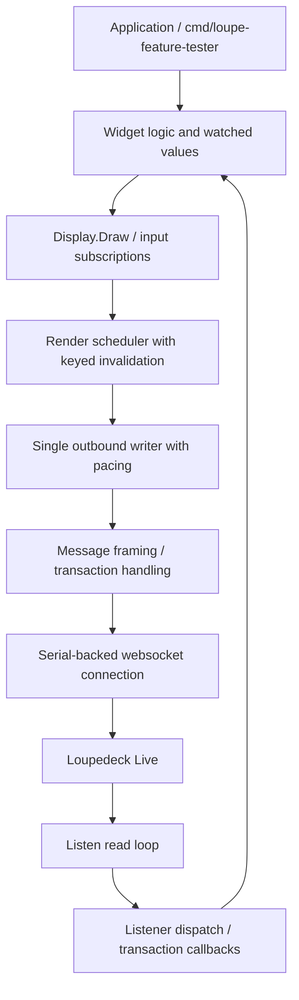

# Technical deep dive: the new go-go-golems loupedeck frontend implementation

## Executive summary

The new `github.com/go-go-golems/loupedeck` implementation is the first version of this repository that should be thought of as a real frontend package rather than as a collection of ticket-local experiments. The earlier work in LOUPE-001 and LOUPE-002 established that direct control of a Loupedeck Live over USB serial is possible, that the hardware can render images and deliver inputs correctly, and that the device becomes unstable when the software sends too many display updates too quickly. That earlier work was valuable, but it left the most important control policy in the wrong place: the application.

The new implementation moves that control policy into the package itself. It does this in layers. First, it introduces a root module and a canonical package namespace. Second, it replaces the old single-slot event binding model with composable listener fanout. Third, it introduces a single outbound writer goroutine that owns all websocket writes and applies pacing. Finally, it adds a render scheduler that coalesces repeated display invalidations by region before they reach the writer. The combined effect is that application code no longer has to scatter `time.Sleep()` calls through widget setup and event handlers to avoid overwhelming the device.

This document is a technical deep dive into that new implementation. It explains not just what changed, but how the algorithms work, why they were chosen, where they live in the codebase, what runtime guarantees they provide, and where the remaining weaknesses still are. The target reader is someone who wants to understand the frontend as an engineered system rather than as a bag of utility functions.

---

## Problem statement

The old implementation was functionally correct but architecturally fragile. It exposed a direct path from widget state changes to transport writes. That meant:

1. one touch or knob gesture could generate a burst of immediate display writes,
2. those writes could overwhelm the device’s serial-WebSocket protocol handling,
3. malformed device responses could panic the library,
4. callback composition was unsafe because one binding overwrote the previous one.

Those failures were visible during LOUPE-002 in the form of websocket protocol errors such as bad opcodes, malformed control frames, and malformed handshake responses. Importantly, not all failures had the same cause. Some were clearly caused by aggressive display traffic during startup or interaction. Others appeared during reconnect cycles or after abrupt termination. Any serious frontend package therefore needed to address two separate classes of problems:

- **steady-state throughput control**, and
- **lifecycle/composition safety**.

The new implementation does not claim to have solved every possible protocol quirk. What it does claim is more important for maintainability: it now has explicit algorithms and package-owned mechanisms for controlling the flow of work.

---

## High-level architecture

The new implementation can be understood as five stacked layers.



### Layer summary

| Layer | Responsibility | Key files |
|------|----------------|-----------|
| App | user-visible command behavior | `cmd/loupe-feature-tester/main.go` |
| Widget/frontend | watched values, touch/knob behavior, display intent | `intknob.go`, `touchdials.go`, `multibutton.go`, `display.go` |
| Renderer | coalescing repeated display invalidations | `renderer.go` |
| Writer | single owner of websocket writes, pacing | `writer.go` |
| Protocol + transport | framing, connection, handshake, read loop | `message.go`, `connect.go`, `dialer.go`, `listen.go` |

This layered split matters because each layer now answers a different engineering question:

- **What state should the UI represent?** → widgets
- **Which visual updates are still worth sending?** → renderer
- **When and in what order should bytes be written?** → writer
- **How do bytes map to protocol messages and device state?** → protocol/transport

That separation did not exist clearly in the old implementation.

---

## Project evolution: from experiment to package

The old repository shape was driven by investigation tickets. The new shape is driven by package ownership.

### Before

- ticket-local `go.mod` files in `ttmp/.../scripts/`
- cloned upstream library in `sources/loupedeck-repo/`
- feature tests depending on local replace paths or copies
- app-level rate limiting and callback workarounds

### After

- root `go.mod`
- root package namespace: `github.com/go-go-golems/loupedeck`
- root command: `cmd/loupe-feature-tester`
- package-owned listener fanout, writer pacing, and renderer coalescing

This is not merely a repository cleanup. It changes where the architectural truth lives. The repository root is now the implementation that should evolve. The upstream clone is now reference material, not the active control surface.

---

## Runtime algorithm 1: composable input listener fanout

One of the most important algorithmic changes is the move from single-slot callbacks to multi-listener fanout.

### The old model

The old implementation stored exactly one callback per button, knob, or touch region:

```go
l.buttonBindings[b] = f
l.knobBindings[k] = f
l.touchBindings[b] = f
```

That meant “last bind wins.” If a widget bound `Touch1` and the app later bound `Touch1` for logging or screen flash behavior, one of them silently replaced the other.

### The new model

The new implementation keeps the old `Bind*` methods as legacy primary bindings, but it adds composable subscription APIs:

```go
func (l *Loupedeck) OnButton(b Button, f ButtonFunc) Subscription
func (l *Loupedeck) OnButtonUp(b Button, f ButtonFunc) Subscription
func (l *Loupedeck) OnKnob(k Knob, f KnobFunc) Subscription
func (l *Loupedeck) OnTouch(b TouchButton, f TouchFunc) Subscription
func (l *Loupedeck) OnTouchUp(b TouchButton, f TouchFunc) Subscription
```

These live in:

- `listeners.go`

### Core data structure

The data structure is map-of-maps keyed by listener ID:

```go
type buttonListeners map[Button]map[uint64]ButtonFunc
type knobListeners map[Knob]map[uint64]KnobFunc
type touchListeners map[TouchButton]map[uint64]TouchFunc
```

A monotonically increasing `listenerID` gives each subscription a stable identity. The returned `Subscription` closes over the key and removes itself from the correct map.

### Dispatch algorithm

The dispatch algorithm is intentionally two-phase:

1. copy the relevant primary binding and listener slice under read lock,
2. unlock,
3. invoke callbacks.

This is important because invoking callbacks while holding the lock would make unsubscribe-inside-callback or nested subscription behavior risky.

Pseudocode:

```text
function dispatchButton(button, status):
    lock listener registry for read
    primary = legacy primary callback for this button/status
    listeners = snapshot of registered listeners for this button/status
    unlock

    if primary exists:
        call primary

    for each listener in listeners:
        call listener
```

### Why this algorithm matters

This is not just a convenience API. It changes the semantics of the package in a way that makes higher-level algorithms possible:

- widgets can subscribe without taking exclusive ownership,
- app code can layer logging and behavior on top,
- future instrumentation can observe events without altering behavior,
- tests can validate event fanout independently of hardware.

### Related files

- `listeners.go`
- `listeners_test.go`
- `inputs.go`
- `listen.go`
- `intknob.go`
- `touchdials.go`
- `multibutton.go`

---

## Runtime algorithm 2: safe lifecycle and error-returning read loop

The old read loop panicked on websocket read failure. That made debugging harder and turned transient protocol issues into full process termination.

### The new read-loop contract

`Listen()` now returns `error`:

```go
func (l *Loupedeck) Listen() error
```

Instead of panicking, it exits the loop and returns a wrapped error.

### Algorithm shape

```text
loop forever:
    read websocket message
    if error:
        return error

    parse message

    if transaction callback exists:
        deliver to callback
        continue

    switch on message type:
        button -> dispatch button listeners
        knob -> dispatch knob listeners
        touch down/up -> dispatch touch listeners
        CT touch -> dispatch CT callback if present
        default -> log unknown message
```

### Why this change matters

This change interacts with every other algorithm in the system:

- app code can now decide what to do when the transport fails,
- the root feature tester can run `Listen()` in a goroutine and capture errors explicitly,
- reconnect and lifecycle behavior can be studied as data rather than as crashes.

### Serial close fix

The package also now closes the actual underlying serial port in `dialer.go`, and `Loupedeck.Close()` returns aggregated close errors instead of discarding them.

That does not solve all reconnect problems, but it removes one obvious correctness hole.

### Related files

- `listen.go`
- `dialer.go`
- `loupedeck.go`
- `cmd/loupe-feature-tester/main.go`

---

## Runtime algorithm 3: single outbound writer with pacing (B-lite)

The B-lite writer is the first place where the package takes ownership of backpressure.

### Design goal

The goal is not yet to decide which display updates are redundant. The goal is to decide that **only one goroutine writes to the websocket**, and that those writes are **paced**.

### Public-facing behavior

From the caller’s point of view, `Send()` is still synchronous:

```go
func (l *Loupedeck) Send(m *Message) error
func (l *Loupedeck) SendWithCallback(m *Message, c transactionCallback) error
```

But internally, those methods now enqueue a command and wait for the writer goroutine to report success or failure.

### Core data structures

In `writer.go`:

```go
type WriterOptions struct {
    QueueSize    int
    SendInterval time.Duration
}

type WriterStats struct {
    QueuedCommands int
    SentCommands   int
    SentMessages   int
    FailedCommands int
    MaxQueueDepth  int
}
```

And the writer itself owns:

- a buffered queue of commands,
- a close signal,
- the pacing interval,
- coarse stats.

### The command abstraction

Commands abstract over one or more protocol messages:

```go
type outboundCommand interface {
    Kind() string
    Messages() ([]*Message, error)
}
```

This is important because not every logical action is one protocol message. A display draw is conceptually one action but physically two protocol messages (`WriteFramebuff` + `Draw`). The command abstraction gives the writer the correct unit of pacing.

### Writer algorithm

The B-lite writer algorithm is:

```text
loop forever:
    receive queued command
    wait until configured send window opens
    expand command into concrete protocol messages
    write each message to websocket in order
    record stats
    report result back to caller
```

More explicitly:

```text
enqueue(command):
    push queuedCommand { command, resultChannel } into writer queue
    wait for resultChannel

writerLoop():
    while running:
        take next queuedCommand
        if sendInterval > 0 and lastSendAt recent:
            sleep until interval boundary
        msgs = command.Messages()
        for msg in msgs:
            conn.WriteMessage(BinaryMessage, msg.asBytes())
        update lastSendAt and stats
        notify caller
```

### Why keep `Send()` synchronous?

A natural question is why not make `Send()` fully asynchronous. The answer is compatibility and observability.

The existing code expects transport errors to appear directly from `Send()`. Preserving that contract means the package can introduce transport ownership without simultaneously forcing all callers to redesign their error handling. It is a conservative but deliberate choice.

### Writer pacing semantics

The pacing interval is applied per **command**, not per low-level message. That means a display draw command still writes its framebuffer and draw messages back-to-back, but multiple display draws cannot stampede the websocket unchecked.

This is a useful middle ground because:

- it matches how the logical UI thinks about work,
- it preserves the atomicity of a display draw intent,
- it reduces inter-command burst pressure.

### Metrics

The writer records:

- queued commands,
- sent commands,
- sent messages,
- failed commands,
- max queue depth.

These are coarse, but they turn the transport into something measurable rather than magical.

### Related files

- `writer.go`
- `writer_test.go`
- `message.go`
- `connect.go`
- `display.go`

---

## Runtime algorithm 4: display draw grouping

Even before full render coalescing, display drawing became more structured through command grouping.

### The old behavior

`Display.Draw()` constructed a framebuffer message and sent it immediately, then constructed a draw message and sent it immediately.

### The new B-lite grouping

`Display.Draw()` constructs a `displayDrawCommand`:

```go
type displayDrawCommand struct {
    framebuffer *Message
    draw        *Message
}
```

This command is then passed to the writer. The writer therefore sees “draw this display region” as one logical piece of work.

### Why this matters

Grouping is a prerequisite for smarter coalescing. Without it, the renderer or writer would have to reason about partially related messages. With grouping, the system can treat a display draw as an indivisible unit.

This is one of the most important transitions from “functions that happen to send bytes” to “a frontend that reasons about UI work.”

---

## Runtime algorithm 5: render invalidation and coalescing (full-B groundwork)

The renderer is the first true full-B component.

### The problem it solves

The writer paces commands, but it does not know whether two commands mean the same region being redrawn repeatedly. Widgets such as `TouchDial` and `MultiButton` naturally produce overwriteable intermediate states.

Examples:

- knob 1 moves from 128 → 129 → 130 → 131 very quickly,
- Touch1 flashes red on press and then restores its icon on release,
- a drag updates the same strip many times in a short interval.

Not all of those intermediate states are worth sending.

### The renderer’s responsibility

The renderer answers the question:

> “For each display region, what is the latest desired visual state at flush time?”

### Core API

In `renderer.go`:

```go
type RenderOptions struct {
    FlushInterval time.Duration
    QueueSize     int
}

type RenderStats struct {
    Invalidations         int
    CoalescedReplacements int
    FlushedCommands       int
    MaxPendingRegionCount int
}
```

### Region keys

The first implementation uses geometry-derived keys:

```text
<display-name>:<x>:<y>:<width>:<height>
```

Examples:

- `left:0:0:60:270`
- `main:0:0:90:90`
- `main:90:180:90:90`

This is simple and works well with the current touch-grid and strip layout.

### Coalescing algorithm

The renderer stores a map from region key to the latest pending command.

Algorithm:

```text
on invalidate(regionKey, command):
    if regionKey already pending:
        increment coalesced replacement count
    pending[regionKey] = command

on flush tick:
    if pending empty:
        do nothing
    else:
        sort keys for deterministic order
        emit each pending command to writer
        clear pending map
        update flushed command count
```

The crucial property is that **latest wins per region**.

### Why this algorithm is effective

It attacks the right kind of redundancy:

- repeated redraws of the same TouchDial strip collapse naturally,
- flash-then-restore behavior on the same tile can collapse if both happen before the next flush,
- multiple separate tiles can still be flushed distinctly because they have different region keys.

This is a strong fit for the Loupedeck UI model because the UI is built from small, stable rectangular regions.

### Relationship to the writer

The renderer does not write bytes directly. It emits commands to the writer.

This gives a clean layered guarantee:

- renderer decides **what** to flush,
- writer decides **when** and **in what transport order** to write.

That separation is important. The renderer is not a second transport layer.

### Test strategy

`renderer_test.go` validates:

- two invalidations to the same region become one flushed command,
- the surviving command reflects the last image,
- coalesced replacement stats increase,
- flushed command counts match expectation.

This is a very direct test of the core algorithm.

### Related files

- `renderer.go`
- `renderer_test.go`
- `display.go`
- `loupedeck.go`
- `connect.go`

---

## Transaction callback synchronization

The writer and read loop make transport concurrency more explicit, so transaction callbacks also needed stronger discipline.

### Problem

The old implementation used a shared map of transaction callbacks with minimal synchronization.

### New approach

`message.go` now uses helper methods such as:

- `setTransactionCallback(...)`
- `takeTransactionCallback(...)`

The read loop retrieves and removes the callback atomically through `takeTransactionCallback()`. This gives a better-defined handoff between the send side and the receive side.

### Why this matters

It avoids a whole class of subtle “callback was observed or cleared at the wrong time” behavior that becomes more likely once the write path is owned by its own goroutine.

---

## Widget behavior on top of the new frontend

The widget layer is still intentionally simple, but it benefits immediately from the new algorithms.

## `WatchedInt`

`WatchedInt` remains the basic observable model value. It is still a tiny type, and that is a virtue. It is the bridge between input changes and display invalidation.

## `IntKnob`

`IntKnob` now subscribes with `OnKnob()` and `OnButton()` instead of claiming exclusive ownership of the underlying input slots.

This means knob state changes and app-level logging can coexist.

## `TouchDial`

`TouchDial` still redraws its display strip when values change, but now those redraws are subject to region coalescing and transport pacing. So even though the widget logic is still eager, the lower layers are no longer blind to repeated redraws.

## `MultiButton`

`MultiButton` still advances state on touch and redraws on state changes. Because it now uses `OnTouch()` and because its display updates flow through the renderer/writer path, app-level flash effects and widget-level state changes can coexist more safely.

### Why this matters architecturally

The widgets have not yet been rewritten into a fully retained-mode UI framework, but they are already running on top of a much safer substrate. That is often the right order for a refactor: improve the substrate first, then decide later whether widget internals also need deeper cleanup.

---

## The new root feature tester as a frontend harness

The root command:

- `cmd/loupe-feature-tester/main.go`

is not just an example. It is the first integrated frontend harness for the new package.

### Why it matters

It exercises the entire stack:

- connection setup,
- read loop,
- listener fanout,
- widget state,
- display drawing,
- writer pacing,
- render invalidation,
- physical device input.

This makes it more valuable than isolated unit tests for judging whether the architecture behaves like a real frontend.

### Important migration difference

The old ticket-local tester needed explicit sleeps in setup to avoid overwhelming the device. The new root command expresses pacing intent through package options and lets the package handle the rest.

That is one of the clearest signals that control has moved into the frontend implementation itself.

---

## Hardware observations and what they say about the algorithms

The hardware observations so far are important because they give us the first evidence that the new algorithms are helping.

### Positive signal

A successful 10-second run showed:

- clean startup,
- successful MultiButton initialization,
- knob value updates,
- raw knob delta logs,
- touch press/release events,
- MultiButton state changes,
- no immediate websocket failure during the observed steady-state window.

The ready log also showed a healthy initial writer state:

```text
QueuedCommands:18 SentCommands:18 SentMessages:32 FailedCommands:0 MaxQueueDepth:1
```

That is exactly the kind of low queue-pressure behavior we hoped the B-lite writer would produce.

### Remaining negative signal

A later rerun failed with a malformed HTTP response during handshake. This appears more consistent with reconnect/reset state corruption after an abrupt stop than with the original “too many display writes right now” problem.

### Interpretation

The algorithms appear to be improving **steady-state transport behavior**. They do **not** yet solve all lifecycle/reconnect fragility. That distinction matters when judging whether a stricter C-style in-flight gate is justified.

At the moment, the stronger case is:

- keep the new writer/renderer model,
- improve clean-exit and reconnect behavior,
- delay any C-style stricter flow control until steady-state behavior demonstrably fails again.

---

## What changed, algorithmically, from the old implementation

This section summarizes the old-vs-new algorithmic shift.

| Concern | Old implementation | New implementation |
|--------|--------------------|--------------------|
| Input handling | single-slot binds | multi-listener fanout + subscriptions |
| Read-loop failure | panic | error-returning loop |
| Serial close | stub/no-op | real underlying port close |
| Outbound writes | direct from arbitrary call sites | one writer goroutine |
| Pacing | application sleeps | package-owned send interval |
| Display draw semantics | immediate `WriteFramebuff` + `Draw` | grouped draw command |
| Redundant redraws | not recognized | keyed invalidation + latest-wins coalescing |
| Transport observability | mostly logs | writer stats + render stats |

This table is the shortest summary of why the new frontend is materially different.

---

## Key algorithms in pseudocode

## Listener fanout

```text
subscribe(eventKey, callback):
    id = nextListenerID()
    registry[eventKey][id] = callback
    return subscription that removes registry[eventKey][id]

on inbound event:
    snapshot listeners under lock
    invoke snapshot outside lock
```

## Writer pacing

```text
send(command):
    queue <- command
    wait for result

writer loop:
    command = <-queue
    sleep until next allowed send slot
    for msg in command.Messages():
        websocket.WriteMessage(msg)
```

## Renderer coalescing

```text
invalidate(regionKey, command):
    pending[regionKey] = command  // replace previous if present

on tick:
    snapshot pending in stable order
    clear pending
    enqueue snapshot commands into writer
```

## Transaction callback handoff

```text
sendWithCallback(msg, cb):
    transactionCallbacks[msg.txn] = cb
    enqueue msg

on inbound response:
    cb = takeTransactionCallback(txn)
    if cb exists:
        cb(response)
```

---

## What is still intentionally incomplete

This deep dive should be honest about what has *not* yet been implemented.

### 1. No priority system in the renderer

All invalidations are currently treated equally.

### 2. No explicit flush-now API

The renderer flushes on interval. Some future interactions may benefit from an immediate flush path.

### 3. No advanced reconnection/recovery protocol

The package closes more correctly than before, but it does not yet implement a device reset or handshake recovery strategy.

### 4. No scene graph

The renderer coalesces rectangular regions, not arbitrary retained UI trees.

### 5. CT-specific multi-listener support is still narrower

The main Live input paths are now composable; some CT-specific paths remain simpler.

These are not failures. They are intentional boundaries for the current phase.

---

## Engineering implications for future work

The new implementation creates three especially important opportunities.

## 1. Better hardware experiments

Because the package now records writer and render stats, future hardware runs can be evaluated quantitatively, not only subjectively.

## 2. Safer widget evolution

Widgets can be rewritten or expanded later without having to solve transport ownership again.

## 3. Better decision-making about C

The old code made it hard to tell whether failures came from burst size, callback collisions, reconnect issues, or protocol weirdness. The new layers narrow that ambiguity. That means future decisions about C can be based on better evidence.

---

## Conclusions

The new `go-go-golems/loupedeck` frontend implementation is a meaningful algorithmic improvement over the earlier experimental codebase. Its most important contribution is not a specific widget or helper method. Its most important contribution is that it now treats the Loupedeck UI as a controlled runtime pipeline:

1. inputs are composable,
2. display work is represented explicitly,
3. redundant work can be collapsed,
4. outbound writes have a single owner,
5. transport failures are surfaced as errors instead of panics.

That is the difference between a useful experiment and an actual frontend implementation.

The current package is not the end state. It still needs deeper reconnect hygiene, more hardware validation, and possibly further render sophistication. But it already has the right kinds of algorithms in the right places. That is the hard part of the refactor, and it is what makes the current implementation worth building on.

---

## References

### Core package implementation

- `go.mod`
- `README.md`
- `connect.go`
- `dialer.go`
- `display.go`
- `inputs.go`
- `intknob.go`
- `listen.go`
- `listeners.go`
- `message.go`
- `multibutton.go`
- `renderer.go`
- `touchdials.go`
- `watchedint.go`
- `writer.go`

### Tests

- `listeners_test.go`
- `renderer_test.go`
- `writer_test.go`
- `loupedeck_test.go`

### Root command harness

- `cmd/loupe-feature-tester/main.go`

### Related ticket docs

- `design-doc/01-go-go-golems-loupedeck-package-backpressure-safe-architecture-and-implementation-guide.md`
- `reference/01-investigation-diary.md`
