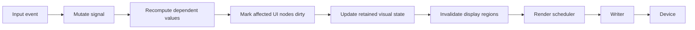
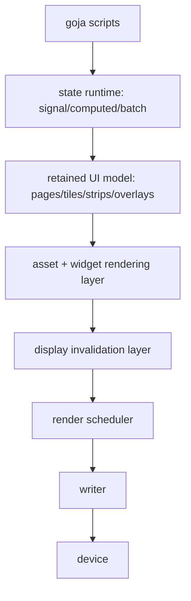
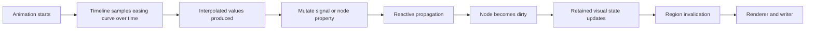

# Textbook: reactive goja UI runtime for dynamic Loupedeck interfaces

## Executive Summary

This document is the textbook-style explanation of the **reactive** version of the future goja-based Loupedeck runtime. It is written for a new intern who is joining the project after the current Go-side renderer and transport stack already exist, but before the script runtime has been implemented.

The key thesis of this document is that the JavaScript API should **not** expose raw transport writes or even raw framebuffer updates as the primary authoring model. Instead, it should expose a **reactive retained UI runtime** built around four ideas:

1. **signals** — small observable state cells holding current values
2. **computed values** — derived state that updates when its dependencies change
3. **retained UI nodes** — tiles, strips, overlays, and pages whose visible properties are derived from state
4. **host-owned animation timelines** — easing-driven interpolation that mutates state or node properties over time without giving scripts direct transport ownership

In this model, scripts describe state and UI relationships. They do not directly decide when bytes are sent to the device. The Go host remains responsible for:

- retaining visual state
- invalidating regions
- coalescing redraw work
- pacing transport writes
- surviving reconnects

This separation is essential because the Loupedeck Live is a constrained serial/WebSocket device, not a forgiving browser canvas.

## Problem Statement

The current Go package is now strong enough to support dynamic scripting in principle:

- `writer.go` centralizes outbound transport ownership
- `renderer.go` coalesces repeated region invalidations
- `display.go` already supports subregion blits
- `svg_icons.go` provides an asset-loading pipeline
- the button-bank demo in `cmd/loupe-svg-buttons/main.go` proves that small animated regions are a good workload shape for the device

However, none of that automatically implies a good JavaScript API.

If we add goja and simply expose low-level APIs like this:

```javascript
deck.drawTile(0, 0, image)
deck.setButtonColor("Button1", { r: 255, g: 0, b: 0 })
deck.flush()
```

then we have recreated the same architectural problem one layer higher. Scripts will gradually accumulate:

- duplicated state
- unbounded imperative updates
- ad hoc timers
- inconsistent animation semantics
- unclear ownership of “what the UI currently is”

The problem therefore is **not** just embedding JavaScript. The problem is designing a scripting runtime where dynamic behavior is easy to write **and** where the host still owns the important low-level policies.

## Who this document is for

This document assumes the reader is:

- comfortable with Go at a moderate level
- comfortable reading JavaScript, but not necessarily a frontend framework expert
- not yet familiar with reactive runtime design
- not yet familiar with the current Loupedeck-specific rendering pipeline

This document is meant to answer:

- what is the reactive model?
- what does “mutate a signal” actually mean?
- how should signals interact with pages, tiles, and animations?
- what parts belong in JS and what parts belong in Go?
- how would we build this in phases without losing control of the transport?

## Why the reactive approach is the preferred one

The earlier brainstorm ticket compared several API styles:

- low-level imperative mutation
- declarative retained pages
- reactive signals/stores
- timeline-centric animation
- hybrid retained + state + timeline

The reactive version discussed here is actually a **hybrid**:

- a retained page/tile model for UI structure
- explicit signals for state
- host-side timelines/tweens for animation and easing
- narrow imperative escape hatches only where necessary

This hybrid is preferred because it matches the current hardware and software realities better than the alternatives.

### Why not only imperative code?

Because a dynamic Loupedeck interface quickly becomes stateful. A knob value may affect:

- text in one tile
- an icon selection in another tile
- a progress strip on the side
- whether a record button is blinking

Imperative code handles one-off operations well, but shared dynamic state becomes hard to reason about when every callback mutates multiple UI elements directly.

### Why not only a huge declarative scene graph?

Because the project does not yet need that full level of abstraction, and the current renderer is still evolving. Going immediately from “safe image blits” to “full retained scene framework” would likely create too much complexity too early.

### Why reactive state fits well here

Reactive state is a strong middle ground because it gives us:

- explicit state cells
- explicit derivation of UI values from state
- easy event wiring from buttons/touches/knobs
- natural integration with animations that interpolate state over time
- a clean host boundary where Go can still own rendering and transport

## The current baseline architecture

Before understanding the reactive runtime, the intern needs to understand the current Go-side stack underneath it.

```mermaid
flowchart TD
    A[App/widget logic] --> B[Display.Draw(image, x, y)]
    B --> C[displayDrawCommand]
    C --> D[renderScheduler]
    D --> E[outboundWriter]
    E --> F[message framing]
    F --> G[Loupedeck device]
```

Important current files:

- `display.go`
  - converts images into RGB565 region payloads
  - packages one logical display update as framebuffer upload + draw trigger
- `renderer.go`
  - coalesces repeated region invalidations
- `writer.go`
  - serializes and optionally paces outbound writes
- `message.go`
  - creates the low-level protocol messages
- `svg_icons.go`
  - loads named image assets that a future JS runtime may refer to by name

The reactive runtime should sit **above** this stack, not replace it.

## The reactive mental model

The simplest way to understand the proposed runtime is:

> **Signals hold state. UI nodes read state. Animations change state over time. The Go host notices what changed and redraws only what needs to change.**

That is the core loop.



The word **reactive** means the runtime tracks *relationships* between state and UI rather than requiring every callback to manually push every visual effect.

## What a signal is

A **signal** is a small state object containing:

- a current value
- a list of dependents (other computations or UI bindings that use it)
- possibly a version counter or dirty flag

Conceptually:

```javascript
const volume = state.signal(0)
```

This means:

- there is a state cell called `volume`
- its current value starts at `0`
- other code can read it using something like `volume.get()`
- other code can change it using something like `volume.set(42)`

### Signal API sketch

```javascript
const state = require("loupedeck/state")

const volume = state.signal(0)
volume.get()        // -> 0
volume.set(10)      // mutate to 10
volume.update(v => v + 1)
```

### Why signals instead of plain JS variables?

A plain JS variable:

```javascript
let volume = 0
```

has no way for the host runtime to know:

- who depends on it
- when it changed
- what should be redrawn because it changed

A signal is not just a box holding a value. It is a box holding a value **with runtime visibility**.

## What “mutate a signal” means

This phrase needs to be made concrete because it is central to the whole reactive design.

When we say **mutate a signal**, we mean:

1. change the signal’s stored value
2. compare old vs new value (if equality checks are enabled)
3. if the value really changed, mark dependents as stale or dirty
4. schedule any necessary recomputation or UI invalidation
5. eventually allow the Go host to redraw the affected regions

In pseudocode:

```text
signal.set(newValue):
    oldValue = signal.value
    if equal(oldValue, newValue):
        return

    signal.value = newValue
    signal.version += 1

    for dependent in signal.dependents:
        dependent.markDirty()

    runtime.scheduleFlush()
```

That is what “mutate” means here. It is not merely assignment. It is assignment **plus dependency propagation**.

### Important detail: mutation is not immediate drawing

A signal mutation should **not** directly mean “draw to the device right now”.

Instead:

- mutation updates state
- state propagation updates retained UI values
- retained UI invalidates regions
- the renderer/writer decide how and when those invalidations become transport work

This protects the architecture from scripts that otherwise would cause draw storms.

## Different forms of signal mutation

### Direct set

```javascript
armed.set(true)
```

Use when the next state is known directly.

### Functional update

```javascript
counter.update(n => n + 1)
```

Use when the new state depends on the previous state.

### Batched mutation

A future runtime may allow batching:

```javascript
state.batch(() => {
  armed.set(true)
  bank.set(2)
  page.set("recording")
})
```

Semantics:

- perform several mutations
- delay propagation/flush until the batch ends

This is useful to prevent redundant intermediate recomputation.

Pseudocode:

```text
batch(fn):
    runtime.batchDepth += 1
    try:
        fn()
    finally:
        runtime.batchDepth -= 1
        if runtime.batchDepth == 0:
            runtime.flushPendingMutations()
```

This will matter a lot for coordinated animations and page transitions.

## Computed values

A **computed** value is derived from one or more signals.

Example:

```javascript
const gain = state.signal(0.75)
const gainLabel = state.computed(() => `${Math.round(gain.get() * 100)}%`)
```

This means:

- `gain` is the source state
- `gainLabel` is derived from it
- when `gain` changes, `gainLabel` becomes dirty and is recomputed

### Why computed values matter

Without computed values, scripts tend to duplicate formatting and derived calculations in many callbacks.

Computed values make derived state explicit and cacheable.

### Pseudocode for computed evaluation

```text
computed.evaluate():
    runtime.pushCurrentComputation(this)
    try:
        newValue = fn()
    finally:
        runtime.popCurrentComputation()

    if newValue != oldValue:
        this.value = newValue
        notify dependents
```

### Dependency tracking concept

When `gainLabel` calls `gain.get()` during evaluation, the runtime records:

```text
gainLabel depends on gain
```

This is the basic reactive graph.

## How UI nodes fit into the reactive graph

The retained UI model should be composed of nodes like:

- page
- tile
- strip
- overlay
- maybe text/icon/progress widgets or properties on nodes

A tile might have properties such as:

- `text`
- `icon`
- `visible`
- `scale`
- `x`, `y`
- `opacity`
- `style`

Some properties may be static:

```javascript
tile.icon("finder")
```

Some may be reactive:

```javascript
tile.text(() => gainLabel.get())
```

That means the tile is itself a dependent in the reactive graph.

### Reactive tile binding example

```javascript
const state = require("loupedeck/state")
const ui = require("loupedeck/ui")

const armed = state.signal(false)

ui.page("home", page => {
  page.tile(0, 0, t => {
    t.icon(() => armed.get() ? "record" : "pause")
    t.text(() => armed.get() ? "REC" : "IDLE")
  })
})
```

Here, the tile properties depend on `armed`. When `armed` changes, the runtime should:

- reevaluate the tile’s `icon` binding
- reevaluate the tile’s `text` binding
- mark the tile dirty if the output changed
- regenerate its retained visual state
- invalidate its display region

## Reactive runtime layers

The intern should think about the reactive runtime as several stacked layers.



### Layer 1: goja module layer

This is the JS API surface:

- `require("loupedeck")`
- `require("loupedeck/ui")`
- `require("loupedeck/state")`
- `require("loupedeck/anim")`
- `require("loupedeck/easing")`

### Layer 2: state runtime

This is where signals/computed values live.

Responsibilities:

- store signal values
- track dependencies
- batch mutations
- schedule recomputations
- propagate dirty state

### Layer 3: retained UI model

Responsibilities:

- store pages and nodes
- know which nodes are visible
- map reactive values to node properties
- know which nodes became visually dirty

### Layer 4: visual realization layer

Responsibilities:

- resolve assets like icons/text
- rasterize or compose tile images
- produce retained per-region visual buffers or images

### Layer 5+: existing Go renderer/writer stack

This is already present and should remain authoritative beneath the JS runtime.

## Proposed module contracts

### `require("loupedeck/state")`

Minimal first-slice API:

```javascript
const state = require("loupedeck/state")

const s = state.signal(initialValue)
s.get()
s.set(value)
s.update(fn)

const c = state.computed(fn)
c.get()

state.batch(fn)
state.watch(source, fn)
```

Recommended semantics:

- `set` mutates and propagates if changed
- `update` derives from previous state
- `computed` is lazily or eagerly reevaluated depending on implementation choice
- `batch` suppresses redundant flushes during grouped mutations

### `require("loupedeck/ui")`

Suggested first-slice API:

```javascript
const ui = require("loupedeck/ui")

ui.page(name, builder)
ui.show(nameOrFn)
ui.onTouch(name, fn)
ui.onButton(name, fn)
ui.onKnob(name, fn)
```

Inside page builders:

```javascript
page.tile(col, row, builder)
page.strip(side, builder)
page.overlay(name, builder)
```

Tile methods:

```javascript
t.icon(nameOrFn)
t.text(valueOrFn)
t.visible(valueOrFn)
t.scale(valueOrFn)
t.x(valueOrFn)
t.y(valueOrFn)
t.opacity(valueOrFn)
t.effect(name)
```

### `require("loupedeck/anim")`

Animation API should ideally mutate node properties or signals over time using host-controlled timelines.

```javascript
const anim = require("loupedeck/anim")

anim.to(target, props, duration, easing, options)
anim.timeline(options)
anim.sequence(steps)
anim.parallel(steps)
anim.cancel(target)
```

### `require("loupedeck/easing")`

```javascript
const easing = require("loupedeck/easing")

easing.linear
easing.inQuad
easing.outQuad
easing.inOutQuad
easing.inCubic
easing.outCubic
easing.inOutCubic
easing.outBack
easing.steps(n)
easing.bezier(x1, y1, x2, y2)
```

## How animations should work in the reactive model

Animations should **not** directly write framebuffer data. They should mutate state or node properties over time.

### Conceptual animation pipeline



This is important because it keeps animation inside the same state-change semantics as ordinary reactive updates.

### Example: press-pop animation

```javascript
ui.onTouch("Touch1", () => {
  anim.timeline()
    .to(tile, { scale: 1.15, y: -4 }, 120, easing.outBack)
    .to(tile, { scale: 1.0, y: 0 }, 180, easing.inOutCubic)
    .play()
})
```

Semantically, this means:

- start timeline
- on each animation tick:
  - compute eased time
  - interpolate `scale` and `y`
  - mutate the tile’s retained properties
  - let the runtime mark the tile dirty

### Example: signal-driven loop

```javascript
const pulse = state.signal(0)

anim.loop(1000, t => {
  pulse.set(easing.inOutSine(t))
})

page.tile(0, 0, t => {
  t.scale(() => 1 + pulse.get() * 0.08)
})
```

This is another important distinction:

- some animations mutate node properties directly
- some animations mutate signals, and UI derives from those signals

Both are valid. The runtime should support both.

## Easing curves explained for interns

An easing curve maps normalized time:

```text
0.0 -> 1.0
```

to normalized progress:

```text
0.0 -> 1.0
```

but in a non-linear way.

### Linear

```text
progress = t
```

No acceleration. Usually feels mechanical.

### `inQuad`

Starts slowly and accelerates.

### `outQuad`

Starts quickly and slows near the end.

### `inOutCubic`

Slow start, fast middle, slow end. Good general-purpose motion.

### `outBack`

Overshoots slightly and settles back. Great for button pops.

### `steps(n)`

Jumps in discrete increments. Useful for retro blinking or sprite-like effects.

### Why easing matters for Loupedeck UIs

The device is small and visually dense. Tiny motions are noticeable. Good easing makes:

- button feedback feel deliberate
- page transitions feel smoother
- blinking/attention cues feel controlled instead of noisy

## Runtime scheduling choices

A reactive runtime needs to decide when to process mutations and animation ticks.

### Option A: process immediately on every mutation

Bad default.

If each `.set()` immediately triggers full propagation and redraw, scripts will accidentally create many redundant intermediate states.

### Option B: batch within the current event turn

Better.

- event callback mutates signals
- runtime batches resulting propagation until callback ends
- then runtime processes dirty graph

### Option C: fixed-timestep animation/update loop in the host

Best likely answer.

- host owns a scheduler tick
- signals and node invalidations are processed at stable points
- animation sampling is consistent
- renderer integration is easier

### Recommended approach

Use a host-driven scheduling model with:

- event-turn batching for direct callback mutations
- a host animation clock for timeline sampling
- explicit final dirty flush into the retained renderer

## Intern-level implementation sketch

This section is the concrete conceptual implementation path.

### Stage 1: pure Go state runtime without goja

Before wiring JS, implement a Go-native reactive core:

- `Signal[T]`
- `Computed[T]`
- dependency graph
- batch semantics

Why?

Because the hard part is not goja binding. The hard part is getting the semantics right.

### Stage 2: retained UI node model in Go

Implement Go-side structures like:

```go
type Page struct { ... }
type TileNode struct { ... }
type StripNode struct { ... }
```

with properties for:

- text
- icon
- transform-ish values (`x`, `y`, `scale`, `opacity`)
- visibility

### Stage 3: reactive bindings from state to nodes

Node properties should be able to be:

- static value
- dynamic function depending on signals/computed values

### Stage 4: visual renderer from nodes to retained images

Node changes should update retained visual state, not directly hit transport.

### Stage 5: goja bindings

Only once the semantics are stable, expose them through goja modules.

## Proposed file and package layout for implementation

This is a proposed future layout, not current code.

```text
runtime/
  js/
    module_loupedeck.go
    module_ui.go
    module_state.go
    module_anim.go
    module_easing.go
  reactive/
    signal.go
    computed.go
    batch.go
    scheduler.go
  ui/
    page.go
    tile.go
    strip.go
    overlay.go
    properties.go
  anim/
    timeline.go
    tween.go
    easing.go
  assets/
    icons.go
    text.go
```

Why this split?

- `runtime/js/` is only adapter glue
- `reactive/`, `ui/`, and `anim/` are domain logic
- domain logic stays testable without goja

This aligns with good goja module-authoring practice: keep business/domain logic out of the goja loader layer.

## Example end-to-end reactive script

```javascript
const ui = require("loupedeck/ui")
const state = require("loupedeck/state")
const anim = require("loupedeck/anim")
const easing = require("loupedeck/easing")

const armed = state.signal(false)
const bank = state.signal(0)
const pulse = state.signal(0)

anim.loop(900, t => {
  pulse.set(easing.inOutSine(t))
})

ui.page("home", page => {
  const rec = page.tile(0, 0, t => {
    t.icon(() => armed.get() ? "record" : "pause")
    t.text(() => armed.get() ? "REC" : "IDLE")
    t.scale(() => armed.get() ? 1 + pulse.get() * 0.07 : 1)
  })

  page.tile(1, 0, t => {
    t.text(() => `BANK ${bank.get() + 1}`)
  })

  ui.onTouch("Touch1", () => {
    armed.update(v => !v)
    anim.timeline()
      .to(rec, { y: -4 }, 120, easing.outBack)
      .to(rec, { y: 0 }, 180, easing.inOutCubic)
      .play()
  })

  ui.onButton("Button2", () => bank.update(v => v + 1))
})

ui.show("home")
```

This example illustrates the full preferred shape:

- explicit state via signals
- derived UI bindings
- host-managed loop animation via `pulse`
- event-driven mutation
- one-off eased timeline effects

## Common failure modes

### Failure mode 1: signal mutation triggers immediate transport writes

This would be a major design error. Signals should invalidate retained state, not write bytes directly.

### Failure mode 2: JS variables mixed with signals inconsistently

If half the UI depends on raw JS variables and half on signals, the runtime loses coherent dependency tracking.

### Failure mode 3: every animation implemented with raw timers and manual tile mutation

That would bypass the reason for having a reactive runtime in the first place.

### Failure mode 4: computed functions with side effects

Computed values should derive state, not mutate unrelated state. Otherwise dependency evaluation becomes unpredictable.

### Failure mode 5: no batching

Without batching, several signal mutations in one callback can create many redundant intermediate recomputations and invalidations.

## Anti-patterns to avoid

- exposing `drawRaw()` or `sendMessage()` to scripts as a normal API
- letting UI nodes directly own writer/transport access
- making `computed()` functions perform I/O or mutate unrelated signals
- making every animation a manual `setInterval`
- rebuilding pages from scratch on every tiny state change when a retained model exists

## Design Decisions

### Decision: the textbook version should assume Go-owned retained visual state

This is the most important architectural choice. JS should describe and mutate state; Go should retain visual state and own rendering/transport.

### Decision: the textbook version should treat animations as host-managed timelines

This gives the runtime consistent timing semantics and makes easing a first-class, testable concept.

### Decision: signals should be explicit objects, not magic variable wrappers

Explicit `signal()/get()/set()/update()` APIs are easier to teach, debug, and port between Go and JS than magical syntax transformations.

### Decision: batching should be built into the semantics early

It is much easier to add batch-aware propagation from the start than to retrofit it after scripts assume immediate propagation everywhere.

## Alternatives Considered

### Alternative A: immediate-mode imperative JS runtime

Rejected as the main teaching model because it does not explain shared state, recomputation, or host-controlled rendering well enough.

### Alternative B: fully declarative UI with no explicit signals

Rejected for this textbook because interns need to understand the state machinery clearly, and signals are the most teachable explicit reactive primitive.

### Alternative C: scripts own the animation loop entirely

Rejected because it risks undermining host scheduling, coalescing, and transport safety.

## Open Questions

1. Should computed values be lazy, eager, or hybrid?
2. Should signals use structural equality, referential equality, or configurable equality?
3. How much procedural per-frame JS should be allowed relative to host-managed timelines?
4. Should page switching itself be a signal (`currentPage`) or a dedicated host concept?
5. How should script exceptions affect retained UI state and animation timelines?

## Implementation Plan

1. Implement the pure Go reactive core (`signal`, `computed`, `batch`).
2. Build a Go-native retained tile/page model that can consume reactive updates.
3. Add a host animation/timeline engine with easing curves.
4. Connect retained dirty-node updates to the current renderer/writer stack.
5. Expose a minimal goja module set (`state`, `ui`, `anim`, `easing`).
6. Add integration tests that run real JS scripts through goja.
7. Only then add more advanced conveniences or imperative escape hatches.

## Reading order for a new intern

1. Read `writer.go` and `renderer.go` first to understand why scripts must not own transport.
2. Read `display.go` to understand the current blit boundary.
3. Read the LOUPE-005 brainstorm doc to understand the broader design space.
4. Read this textbook front to back.
5. Read the example scripts reference.
6. Then start implementing the pure Go reactive core before touching goja bindings.
