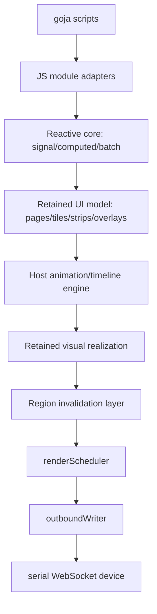

# Implementation plan: reactive goja UI runtime for dynamic Loupedeck interfaces

## Executive Summary

This document is the **implementation roadmap** for the preferred reactive goja approach described in the earlier LOUPE-005 brainstorming and textbook documents. It is written as an execution plan for a new intern or engineer who needs to actually build the system, not merely discuss it.

The key implementation decision is this:

> **Do not start with goja bindings. Start with a pure-Go reactive core and a retained UI model, then connect those to the existing renderer/writer stack, and only then expose JavaScript modules.**

That order matters because the difficult parts of this system are semantic, not just syntactic. If the project starts by exposing Go objects to goja too early, it will mix together four different kinds of complexity:

- reactive-state semantics
- retained UI/state semantics
- animation/timeline semantics
- goja binding semantics

The safer approach is phased:

1. implement the reactive core in pure Go
2. implement the retained page/tile model in pure Go
3. bridge retained UI updates into the current renderer/writer pipeline
4. implement the host animation/timeline/easing engine
5. then expose the minimal stable slice to goja
6. only after that, add more dynamic power such as advanced assets, procedural callbacks, and reconnect persistence

This plan is intentionally conservative because the underlying hardware is still a fragile serial/WebSocket device. The script runtime must add expressiveness **without** reintroducing transport chaos.

## Problem Statement

The current Go project already has the transport and rendering groundwork needed for a higher-level runtime:

- `writer.go` gives package-owned transport serialization and pacing
- `renderer.go` gives region-key invalidation and coalescing
- `display.go` gives partial display-region blits
- `svg_icons.go` gives a practical asset pipeline for named icon imagery
- `cmd/loupe-svg-buttons/main.go` demonstrates dynamic banked tile animation workloads that map naturally onto a page/tile UI model

However, this is still a **Go-authored** runtime. There is no JavaScript scripting layer yet, no reactive state system, and no retained scene/page model that scripts can mutate safely.

The implementation problem is therefore to build a stack that lets JavaScript express dynamic UI behavior like this:

```javascript
const state = require("loupedeck/state")
const ui = require("loupedeck/ui")
const anim = require("loupedeck/anim")
const easing = require("loupedeck/easing")

const armed = state.signal(false)

ui.page("home", page => {
  const rec = page.tile(0, 0, t => {
    t.icon(() => armed.get() ? "record" : "pause")
    t.text(() => armed.get() ? "REC" : "IDLE")
  })

  ui.onTouch("Touch1", () => {
    armed.update(v => !v)
    anim.timeline()
      .to(rec, { scale: 1.15 }, 120, easing.outBack)
      .to(rec, { scale: 1.0 }, 180, easing.inOutCubic)
      .play()
  })
})
```

while preserving Go-side ownership of:

- retained visual state
- dirty-region invalidation
- coalescing
- transport pacing
- reconnect recovery

## Architecture target

The target architecture should look like this:



### Layer responsibilities

#### JS module adapters

- expose the runtime through goja modules
- convert JS arguments into Go-side service calls
- should contain little or no business logic

#### Reactive core

- own signals, computed values, batching, and dependency tracking
- determine what has become dirty due to state changes

#### Retained UI model

- own pages, tiles, strips, and overlays
- bind node properties to reactive state
- know which nodes are currently active/visible

#### Host animation engine

- advance timelines on the host clock
- interpolate with easing curves
- mutate state or retained node properties

#### Retained visual realization

- turn current node state into tile images / visual buffers
- update only what changed

#### Existing renderer/writer

- remain the low-level output path
- continue to own coalescing and transport pacing

## Core implementation principles

### Principle 1: transport must stay below the runtime

JavaScript must never send raw framebuffer messages. The highest level a script should reach is retained UI state or node properties.

### Principle 2: pure Go first, goja second

Anything semantic should be implemented and tested without goja first.

### Principle 3: state changes invalidate visuals, not sockets

A signal mutation should eventually cause region invalidation, not immediate transport writes.

### Principle 4: make the first slice small but real

The first JS-capable milestone should already run a useful script, but it should only cover a narrow stable API:

- pages
- tiles
- text/icon bindings
- signals
- events

### Principle 5: animation should be host-managed

Use Go-side timelines/tweens/easing instead of allowing every script to roll its own timer math as the default.

## Recommended implementation order

This is the most important section of the document.

### Phase 0: narrow the first user-facing slice before writing code

Before implementing, lock down the **first stable slice**.

Recommended first slice:

- `require("loupedeck/state")`
  - `signal`, `computed`, `batch`
- `require("loupedeck/ui")`
  - `page`, `show`, `tile`, `text`, `icon`
  - `onTouch`, `onButton`, `onKnob`
- no animation yet
- no procedural per-frame JS yet

Why this first?

- it is enough to build real dynamic pages
- it exercises the full retained/reactive architecture
- it avoids timeline complexity until the base model is proven

Deliverable:

- a short RFC or README inside the implementation branch describing the exact first module shapes

## Phase 1: implement the pure-Go reactive core

### Goal

Build and test the semantics of signals, computed values, dependency tracking, and batching **without** any goja dependency.

### Proposed package

```text
runtime/reactive/
```

### Proposed files

```text
runtime/reactive/signal.go
runtime/reactive/computed.go
runtime/reactive/batch.go
runtime/reactive/runtime.go
runtime/reactive/types.go
runtime/reactive/signal_test.go
runtime/reactive/computed_test.go
runtime/reactive/batch_test.go
```

### Core types to implement

Possible shape:

```go
type Runtime struct { ... }

type Signal[T any] struct { ... }

type Computed[T any] struct { ... }
```

### Required semantics

#### Signal

- holds current value
- exposes `Get`, `Set`, `Update`
- tracks dependents
- avoids propagation if equality says value did not change

#### Computed

- evaluates function in dependency-tracking context
- records signal/computed dependencies when `Get()` is called inside evaluation
- caches last value
- can be marked dirty when dependencies change

#### Batch

- groups many mutations
- delays propagation/final flush until the batch closes
- prevents repeated redundant work during coordinated updates

### Pseudocode for signal mutation

```text
Set(newValue):
    if equal(current, newValue):
        return
    current = newValue
    version++
    mark dependents dirty
    if not batched:
        flush reactive runtime
```

### Tests required

At minimum:

1. `Set` changes value and notifies dependents
2. setting equal value does not propagate unnecessarily
3. `Update(fn)` works
4. `Computed` reevaluates when dependency changes
5. diamond dependency graphs do not double-apply propagation
6. batching suppresses redundant intermediate recomputation
7. nested batching works or is explicitly disallowed with tested semantics

### Acceptance criteria

- no goja imports anywhere in this package
- pure unit tests pass
- runtime behavior is deterministic enough to explain simply to a new engineer

## Phase 2: implement the retained UI model in pure Go

### Goal

Build a host-owned UI representation that can consume reactive values and produce stable visual state.

### Proposed package

```text
runtime/ui/
```

### Proposed files

```text
runtime/ui/page.go
runtime/ui/tile.go
runtime/ui/strip.go
runtime/ui/overlay.go
runtime/ui/node.go
runtime/ui/properties.go
runtime/ui/ui_test.go
```

### Initial object model

#### Page

Represents one screenful of content.

Should likely contain:

- page name
- tile nodes
- strip nodes (optional in first cut)
- overlays (optional in first cut)
- visibility/active state

#### Tile node

Represents one `90×90` tile on the main touchscreen.

Initial properties:

- icon name or icon binding
- text or text binding
- visible
- maybe style/theme hook

Do **not** add too many transform properties yet if the first slice excludes animations.

### Binding model

Each property should support either:

- static value
- reactive binding function

Example conceptually:

```go
tile.BindText(func() string { return levelLabel.Get() })
tile.SetIcon("finder")
```

The actual API can evolve, but the host-side model needs to support both.

### Dirty-node tracking

When a binding output changes:

- the node becomes visually dirty
- the runtime records that this node needs visual regeneration

This is **not yet** the same thing as display invalidation. Dirty node means the retained visual representation of that node is stale.

### Tests required

1. static property assignment works
2. reactive property bindings update when source signals change
3. only affected nodes become dirty
4. page visibility rules are respected
5. showing a different page changes which nodes are active

### Acceptance criteria

- nodes can be updated from the reactive runtime without any transport code
- page/tile abstractions feel stable enough to expose later to JS

## Phase 3: build the retained visual realization layer

### Goal

Turn dirty nodes into updated visual buffers/images.

This is the layer that bridges:

- retained node state
- actual `image.Image` or retained tile-image output

### Proposed package

```text
runtime/render/
```

### Proposed files

```text
runtime/render/visual_runtime.go
runtime/render/tile_renderer.go
runtime/render/text_renderer.go
runtime/render/icon_renderer.go
runtime/render/assets.go
runtime/render/render_test.go
```

### First-slice rendering rules

For the initial JS runtime slice, keep visuals modest:

- text tiles
- icon tiles
- maybe icon + text combined if already easy

Avoid the temptation to add a full general-purpose compositing DSL immediately.

### How this should work

1. UI runtime asks: which active nodes are visually dirty?
2. For each dirty node:
   - resolve bound values
   - fetch named assets if necessary
   - render to a retained `image.Image` or tile buffer
3. compute destination region for that node
4. invalidate that region in the current renderer

### Why this layer should exist separately

Without this separation, the retained UI model would become too entangled with concrete drawing code.

## Phase 4: connect retained visuals to the existing renderer/writer pipeline

### Goal

Use the current `Display.Draw()` / `renderer.go` / `writer.go` stack rather than inventing a second output path.

### Required bridging

The visual runtime should know:

- which display a node belongs to
- which region rectangle it maps to
- which generated image should be passed to `Display.Draw()`

For tiles, that likely means:

- tile coordinates -> pixel coordinates on `main` display
- image buffer -> `Display.Draw(im, x, y)`

### Important constraint

Do **not** bypass:

- `display.go`
- `renderer.go`
- `writer.go`

They are already the correct host-owned output path.

### Tests required

Use fakes/mocks similarly to current renderer/writer tests:

1. changing one tile invalidates only that tile region
2. changing several bindings in one batch does not produce redundant send storms
3. current active page change redraws only the correct visible regions

## Phase 5: add host event runtime and lifecycle shell

### Goal

Build the host services that the JS runtime will later expose:

- button/touch/knob subscriptions
- page switching
- timers
- runtime error handling

### Proposed package

```text
runtime/host/
```

### Proposed files

```text
runtime/host/events.go
runtime/host/pages.go
runtime/host/timers.go
runtime/host/errors.go
runtime/host/runtime.go
runtime/host/runtime_test.go
```

### What this layer should do

- subscribe to current Go input events (`OnButton`, `OnTouch`, `OnKnob`)
- route them into runtime callbacks
- own current page name
- own timer registration/execution

### Important design decision

Timers should be host-owned, not script-owned goroutines.

That means JS can ask for time-based behavior, but Go owns:

- scheduling
- cancellation
- cleanup on page unload/runtime shutdown

## Phase 6: add the host animation engine and easing module in pure Go

### Goal

Implement animation/tween/timeline semantics before exposing them to JS.

### Proposed packages

```text
runtime/anim/
runtime/easing/
```

### Proposed files

```text
runtime/anim/tween.go
runtime/anim/timeline.go
runtime/anim/sequence.go
runtime/anim/parallel.go
runtime/anim/loop.go
runtime/anim/anim_test.go

runtime/easing/easing.go
runtime/easing/easing_test.go
```

### Initial animation features

- `to(target, props, duration, easing)`
- simple timeline chaining
- repeat / yoyo
- cancellation

### Initial easing features

- linear
- in/out/inOut quad
- in/out/inOut cubic
- outBack
- steps(n)
- maybe bezier factory if easy enough

### Target model

Animations should mutate:

- retained node properties (later)
- maybe signals (if explicitly exposed)

### Why animations should come after retained UI

Animations need stable targets. Without retained nodes or stable signal semantics, the animation API will be built on sand.

## Phase 7: wire goja module adapters

### Goal

Expose the already-tested pure-Go runtime layers through goja.

### Proposed packages

```text
runtime/js/module_loupedeck
runtime/js/module_ui
runtime/js/module_state
runtime/js/module_anim
runtime/js/module_easing
```

### Proposed files

```text
runtime/js/module_loupedeck/module.go
runtime/js/module_ui/module.go
runtime/js/module_state/module.go
runtime/js/module_anim/module.go
runtime/js/module_easing/module.go
```

### Adapter rules

Per goja module-authoring best practice:

- keep domain logic out of module loader code
- loaders should decode JS inputs and call services
- use lowerCamelCase API names in JS
- add real integration tests using `require(...)`

### First goja slice to expose

Initially expose only:

- `loupedeck/state`
  - `signal`, `computed`, `batch`
- `loupedeck/ui`
  - `page`, `show`, `onTouch`, `onButton`, `onKnob`
  - tile `text` / `icon`
- maybe a tiny `loupedeck` core module for lifecycle/logging

Do **not** expose animation in the same first PR unless the pure-Go animation layer is already complete and stable.

### Integration tests required

Add tests that boot goja and run small scripts:

1. static page script renders expected retained state
2. button/touch event mutates signal and changes bound tile output
3. `batch()` semantics visible from JS behave correctly
4. runtime can load modules via `require("loupedeck/state")`, etc.

## Phase 8: build the first end-to-end example script and command

### Goal

Create one real host executable that:

- loads a JS script
- builds a page
- responds to live input
- updates the device through the retained runtime

### Recommended first example

A minimal reactive page:

- one tile showing a counter
- one tile showing a named icon based on state
- touch toggles state
- knob changes value

Why this is the best first example:

- it uses all major concepts
- it stays easy to debug
- it does not depend on complex asset/animation logic yet

## Phase 9: add animation/easing to the JS surface

### Goal

Once the basic runtime is working, expose:

- `require("loupedeck/anim")`
- `require("loupedeck/easing")`

### First JS animation scenarios to validate

1. touch press-pop effect
2. looping pulse on one tile
3. bank/page transition with easing
4. knob-scrubbed timeline progress

### Why these scenarios

They exercise:

- one-shot timeline
- looping animation
- transition orchestration
- direct user-controlled animation state

## Phase 10: reconnect recovery and retained state replay

### Goal

Make the runtime recoverable when the device reconnects.

### Host behavior on reconnect

- restore active page
- restore retained node property state
- re-render visible regions
- restart host-owned animations if appropriate

### Why this is not optional long-term

A dynamic JS runtime without reconnect recovery would feel much more fragile than the current Go demos. Since Go owns retained visual state, it should eventually also own replay after reconnect.

## Package/file roadmap summary

A likely repository addition could look like this:

```text
runtime/
  reactive/
    runtime.go
    signal.go
    computed.go
    batch.go
    *_test.go
  ui/
    page.go
    tile.go
    strip.go
    overlay.go
    properties.go
    *_test.go
  render/
    visual_runtime.go
    tile_renderer.go
    icon_renderer.go
    text_renderer.go
    *_test.go
  host/
    runtime.go
    events.go
    pages.go
    timers.go
    errors.go
    *_test.go
  anim/
    tween.go
    timeline.go
    sequence.go
    parallel.go
    loop.go
    *_test.go
  easing/
    easing.go
    *_test.go
  js/
    module_loupedeck/
    module_ui/
    module_state/
    module_anim/
    module_easing/
```

This split is deliberate:

- domain logic remains pure Go and testable
- goja adapters remain thin
- each layer has a clean responsibility

## PR / milestone breakdown

This is how I would break the implementation into reviewable increments.

### Milestone A: reactive core only

PR contents:

- `runtime/reactive/*`
- tests only

Acceptance:

- no goja dependency
- signal/computed/batch semantics stable

### Milestone B: retained UI model only

PR contents:

- `runtime/ui/*`
- tests only

Acceptance:

- tiles/pages can bind to reactive values
- no transport integration yet

### Milestone C: retained visuals to renderer bridge

PR contents:

- `runtime/render/*`
- bridge to existing renderer/writer
- tests with fake transport if possible

Acceptance:

- dirty nodes become dirty regions
- transport remains host-owned

### Milestone D: host runtime shell

PR contents:

- `runtime/host/*`
- input events and timers

Acceptance:

- host can manage current page and event callbacks without JS yet

### Milestone E: first goja slice

PR contents:

- `runtime/js/module_state`
- `runtime/js/module_ui`
- tiny example script command

Acceptance:

- first useful script runs

### Milestone F: animations and easing

PR contents:

- `runtime/anim/*`
- `runtime/easing/*`
- JS modules

Acceptance:

- eased touch and looping animations work through the retained runtime

### Milestone G: reconnect replay / resilience

Acceptance:

- active retained UI can be restored after reconnect

## Acceptance criteria for the whole first implementation slice

Before claiming the reactive runtime “exists”, the first slice should satisfy all of these:

1. a JS script can define at least one page with tiles
2. a JS signal mutation changes visible UI through retained state, not direct draw calls
3. host-owned input events can mutate signals from JS callbacks
4. the runtime invalidates only changed regions
5. transport remains under current writer/renderer ownership
6. unit tests cover reactive semantics
7. goja integration tests cover module loading and small scripts

## Risks and mitigations

### Risk 1: too much complexity too early

Mitigation:
- keep the first slice tiny
- no animation in first JS milestone unless absolutely stable underneath

### Risk 2: hidden dependency bugs in the reactive graph

Mitigation:
- pure Go tests first
- explicit dependency-tracking tests
- avoid magical behavior where possible

### Risk 3: runtime jank from script callbacks

Mitigation:
- host-owned scheduling
- keep JS callbacks event-scoped initially
- defer procedural per-frame callbacks

### Risk 4: reconnect breaks retained/runtime assumptions

Mitigation:
- keep Go as the owner of retained visual state
- add replay later as a planned milestone

## Open Questions

1. Should `computed` values be lazy or eager in the first cut?
2. Should the first visual node types include strips, or only tiles?
3. Should animations initially target signals, nodes, or both?
4. What minimal runtime debugging API should scripts get?
5. How should script exceptions be surfaced on-device, if at all?

## Reading guide for the intern

Recommended reading order:

1. `writer.go`
2. `renderer.go`
3. `display.go`
4. LOUPE-005 design doc `01-brainstorm-...`
5. LOUPE-005 design doc `02-textbook-reactive-...`
6. this implementation plan
7. LOUPE-005 example scripts doc

Then implement in this order:

1. reactive core
2. retained pages/tiles
3. retained visuals -> renderer bridge
4. host runtime shell
5. goja adapters
6. animations/easing
