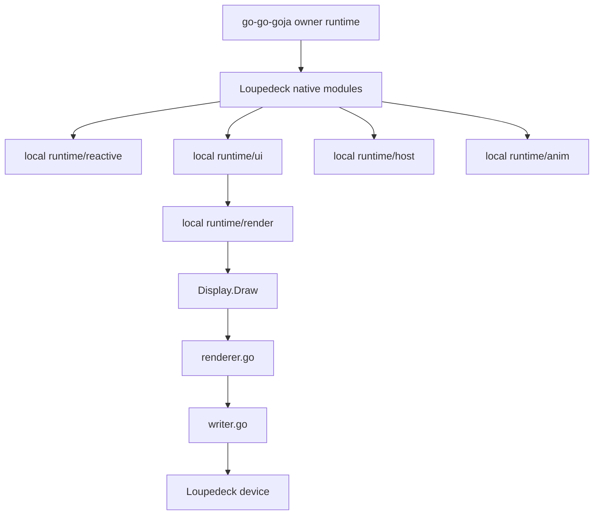

# Implementation plan: converge the Loupedeck JS runtime onto go-go-goja runtime ownership

## Executive Summary

The first LOUPE-005 implementation pass successfully proved that a retained, reactive, goja-based Loupedeck UI runtime is viable. The repository now contains:

- a pure-Go reactive core
- a retained page/tile UI model
- a retained renderer bridge
- a host runtime shell
- native `require(...)` modules for state, UI, animation, and easing
- a reconnect-safe retained replay primitive

However, that first pass still has an architectural weakness: **JavaScript callback execution is not yet governed by a formal runtime-owner abstraction**. In practice, that means the current implementation is acceptable for tests and limited demos, but it is not yet the right foundation for confident live hardware-backed interactive scripts.

The long-term solution already exists elsewhere in the local ecosystem: the `go-go-goja` repository provides a reusable owner-thread and runtime-composition model centered around:

- `pkg/runtimeowner`
- `pkg/runtimebridge`
- `engine.Factory`
- runtime-scoped module registration patterns
- Promise/callback settlement through owner-thread `Call(...)` / `Post(...)`

This document describes how to refactor the current Loupedeck JS runtime onto that model **without giving up the Loupedeck-specific rendering and transport stack that already works well**.

The central thesis is:

> **Use go-go-goja for JS runtime ownership and async/module discipline; keep Loupedeck-specific retained UI, rendering, pacing, and transport policy in this repository.**

That is the right split of responsibility.

## Problem Statement

The current LOUPE-005 runtime has the correct high-level UI architecture but an insufficiently formalized goja execution model.

### What is already good

The current repository already has the Loupedeck-specific pieces in the right place:

- Go owns the writer and render scheduler
- Go owns retained page/tile state
- Go owns display-region invalidation
- Go owns reconnect replay policy
- JavaScript does not own the raw device transport

Those are all good decisions and should be preserved.

### What is currently weak

The current JS runtime bootstrap and modules still allow JS functions to be reached from Go-owned callbacks in a way that is not yet explicitly serialized through a dedicated owner-runner abstraction. Examples include:

- hardware event callbacks (`onButton`, `onTouch`, `onKnob`)
- host timer callbacks
- animation loop/tween callbacks
- reactive binding reevaluations that ultimately call JS closures

The functional symptom is not necessarily immediate breakage in tests. The architectural problem is more subtle:

- goja must be treated as single-threaded
- background goroutines and device callbacks must never touch JS values/functions directly from arbitrary goroutines
- Promise settlement and callback invocation should always be routed back to the owner thread

The `go-go-goja` repository solves exactly this class of problem already, and does so with reusable code rather than one-off command glue.

## Evidence from go-go-goja

This section summarizes the relevant findings from the `go-go-goja` codebase.

### `pkg/runtimeowner`

Files:

- `/home/manuel/code/wesen/corporate-headquarters/go-go-goja/pkg/runtimeowner/runner.go`
- `/home/manuel/code/wesen/corporate-headquarters/go-go-goja/pkg/runtimeowner/types.go`
- `/home/manuel/code/wesen/corporate-headquarters/go-go-goja/pkg/runtimeowner/errors.go`
- `/home/manuel/code/wesen/corporate-headquarters/go-go-goja/pkg/runtimeowner/runner_test.go`
- `/home/manuel/code/wesen/corporate-headquarters/go-go-goja/pkg/runtimeowner/runner_race_test.go`

What it provides:

- `Runner.Call(...)` for request/response execution on the owner thread
- `Runner.Post(...)` for fire-and-forget owner-thread work
- cancellation handling
- schedule rejection handling
- panic recovery
- closure/teardown semantics
- tests for concurrency, cancellation, leaked owner context, and race safety

This is the exact missing abstraction in the current LOUPE-005 runtime.

### `pkg/runtimebridge`

File:

- `/home/manuel/code/wesen/corporate-headquarters/go-go-goja/pkg/runtimebridge/runtimebridge.go`

What it provides:

- per-VM storage of runtime-scoped bindings:
  - context
  - event loop
  - owner runner

This allows modules to look up the owner-thread scheduler without relying on ad hoc globals or command-local closures.

### `engine/factory.go`

File:

- `/home/manuel/code/wesen/corporate-headquarters/go-go-goja/engine/factory.go`

What it provides:

- explicit owned-runtime construction
- runtime lifecycle context
- event loop startup
- runtimeowner setup
- runtimebridge binding installation
- module registry composition
- runtime-scoped module registration
- runtime initializer hooks

This is a stronger and more reusable version of the current local `runtime/js/env` + `runtime/js/runtime` bootstrap logic.

### Async module guidance and example

Files:

- `/home/manuel/code/wesen/corporate-headquarters/go-go-goja/pkg/doc/03-async-patterns.md`
- `/home/manuel/code/wesen/corporate-headquarters/go-go-goja/modules/timer/timer.go`

What they demonstrate:

- Promise creation can happen on the VM thread
- background work should happen in goroutines
- Promise resolution/rejection must be posted back to the owner thread
- `runtimeowner.Runner` is the preferred reusable API over raw loop scheduling

This pattern should directly govern future Loupedeck async/hardware-facing JS behavior.

## Proposed Solution

Refactor the current LOUPE-005 runtime to use the `go-go-goja` runtime-owner model while keeping Loupedeck-specific rendering and retained-state logic local.

### High-level target architecture

### Responsibility split

#### go-go-goja should own

- goja runtime ownership
- event loop and owner-thread scheduling discipline
- runtime-scoped module bindings for async use
- module registration composition
- Promise/callback settlement patterns

#### this repository should continue to own

- retained reactive UI semantics
- page/tile model
- tile rendering and display-region mapping
- Loupedeck-specific host event semantics
- writer/render scheduler/transport behavior
- reconnect replay policy

## Design Decisions

### Decision 1: do not replace the Loupedeck rendering stack

The refactor should **not** move rendering and transport policy into `go-go-goja`. That would be the wrong abstraction boundary.

Rationale:

- `go-go-goja` is the JS-runtime framework
- this repo is the device-specific frontend/runtime implementation
- mixing those would blur responsibilities and risk transport regressions

### Decision 2: converge the JS execution model before adding serious hardware-backed JS demos

Interactive and animated hardware-backed demos should wait until the owner-runner pattern is in place.

Rationale:

- correctness comes before demo breadth
- once event/timer/animation callbacks all serialize correctly, demos become much more trustworthy

### Decision 3: use runtimeowner-style execution even for local modules that are currently synchronous

Even if a particular module export currently looks synchronous, its callback and Promise behavior should be refit around the owned-runtime model.

Rationale:

- consistency matters more than micro-optimizing away one scheduler hop
- future async evolution becomes safer if modules already assume the owner-thread contract

### Decision 4: move toward runtime-scoped module registration rather than ad hoc env lookups everywhere

The current `runtime/js/env` layer is serviceable, but long-term it should either become a structured runtime-scoped binding layer or be replaced with a go-go-goja-style runtime-module registrar pattern.

Rationale:

- better separation between module glue and domain services
- better testability
- clearer path toward reusing `go-go-goja` engine/factory composition

## Alternatives Considered

### Alternative A: keep the current local bootstrap and just “be careful” with goroutines

Rejected.

This would leave too much correctness burden on discipline and code review. The exact class of bug `runtimeowner` is meant to prevent would remain easy to reintroduce.

### Alternative B: copy only a tiny helper and ignore the broader go-go-goja model

Rejected as the long-term answer.

A minimal helper might fix one immediate issue, but it would leave us reinventing runtimebridge/factory/module lifecycle patterns piecemeal.

### Alternative C: fully migrate the Loupedeck runtime into go-go-goja immediately

Rejected for now.

That would be too large a move and would risk mixing framework ownership with device-specific rendering ownership too early.

### Preferred alternative: incremental convergence

Preferred.

- adopt owner-thread discipline first
- adopt runtime-scoped bindings second
- optionally adopt factory/module-composition patterns more fully after that

## Migration strategy

This should be an incremental refactor, not a rewrite.

### Stage 1: introduce owner-runner discipline locally

Bring in or depend on the `runtimeowner` pattern and make the current local JS runtime execute all JS callbacks through it.

### Stage 2: introduce runtime-scoped bindings

Add a local equivalent of `runtimebridge` or depend directly on it so modules can look up owner/context safely.

### Stage 3: refit modules to the owner-thread contract

Refactor:

- `loupedeck/state`
- `loupedeck/ui`
- `loupedeck/anim`
- `loupedeck/easing`

so background or deferred work settles back onto the owner thread explicitly.

### Stage 4: build hardware-backed JS runner and examples

Only after the above stages are in place should the project add serious hardware-backed interactive JS demos.

### Stage 5: consider deeper factory convergence

Once the runtime is owner-safe, evaluate whether local bootstrap code should be replaced by or wrapped around a go-go-goja `engine.Factory` composition flow.

## Detailed Implementation Plan

## Phase H0: write the convergence plan and task breakdown

Deliverables:

- this design doc
- task breakdown in `tasks.md`
- diary/changelog continuity

Why this phase matters:

- the refactor has a real architectural direction now
- future code work should be traceable to this plan rather than becoming ad hoc

## Phase H1: add runtime-owner integration layer

### Goal

Introduce a formal owner-thread execution layer to the Loupedeck JS runtime.

### Recommended choices

Option 1:
- import and depend on `github.com/go-go-golems/go-go-goja/pkg/runtimeowner` if module/dependency boundaries make that practical

Option 2:
- port the `pkg/runtimeowner` package into this repository as an interim local package while preserving its semantics and tests

### Work items

- add a scheduler/owner abstraction for the JS runtime
- update runtime creation to provision:
  - goja VM
  - loop
  - owner runner
- ensure runtime shutdown closes the owner cleanly

### Acceptance criteria

- there is one explicit owner-runner abstraction in use
- no module or command relies on direct arbitrary-goroutine JS execution anymore
- tests cover scheduling, close, cancellation, and panic behavior

## Phase H2: add runtime-scoped bindings / bridge

### Goal

Give native modules a standard way to access:

- runtime context
- owner runner
- event loop if still needed
- Loupedeck-specific service bundle

### Work items

- add a local runtime-bridge binding layer or adopt `go-go-goja/pkg/runtimebridge`
- install bindings during runtime bootstrap
- expose Loupedeck-specific runtime services through a typed context/binding object

### Acceptance criteria

- modules no longer depend on scattered closure capture for runtime-scoped async behavior
- a module can look up the owner/context safely from the VM

## Phase H3: refactor JS callback boundaries to owner-thread scheduling

### Goal

Ensure all JS callback entry points are serialized through the owner runner.

### Callback classes to refit

- button callbacks
- touch callbacks
- knob callbacks
- `watch(...)` / effect callbacks if they execute JS closures
- reactive property binding callbacks if they execute JS closures
- animation/tween callbacks
- loop/timer callbacks
- Promise settlement callbacks in future async modules

### Important rule

No Go callback that may execute on an arbitrary goroutine should directly call a JS function.

### Acceptance criteria

- every JS function invocation from host-side deferred/event work is routed through owner `Call(...)` or `Post(...)`
- integration tests cover concurrent or repeated event delivery without races

## Phase H4: refactor module shape toward go-go-goja-style module discipline

### Goal

Make local native modules look more like the `go-go-goja` module model.

### Work items

- separate thin module glue from domain/runtime services more clearly
- avoid environment bootstrap logic leaking too deeply into module code
- consider exporting module registration through a registrar layer rather than manually wiring every module directly in one file

### Acceptance criteria

- module code is mostly argument decoding and owner-thread scheduling glue
- domain logic remains in local pure-Go runtime packages

## Phase H5: introduce hardware-backed JS live runner

### Goal

Add a `cmd/loupe-js-live` style command that runs JS against a real device using the owner-safe runtime.

### Responsibilities of the command

- connect to device
- set displays
- create owned JS runtime
- attach host runtime to the live deck event source
- execute a script
- run a retained render/flush loop
- optionally expose flags for duration, render cadence, and script path

### Acceptance criteria

- a static script renders to hardware
- an interactive script responds to button/touch/knob events on hardware
- an animated script runs without unsafe callback execution patterns

## Phase H6: add multiple JS examples and hardware validation

### Goal

Produce a useful script pack that validates the owner-safe runtime on actual hardware.

### Proposed example set

1. `01-hello.js`
2. `02-counter-button.js`
3. `03-knob-meter.js`
4. `04-touch-feedback.js`
5. `05-pulse-animation.js`
6. `06-page-switcher.js`

### Acceptance criteria

- each example runs in non-hardware PNG/demo mode where practical
- selected examples are validated on real hardware
- ticket docs capture exact commands and hardware observations

## Phase H7: optionally converge onto go-go-goja engine/factory composition more fully

### Goal

Evaluate whether the local `runtime/js/runtime.go` bootstrap should be replaced or wrapped by a factory composition flow closer to `go-go-goja/engine.Factory`.

### Questions to answer

- should Loupedeck-specific modules become runtime module registrars?
- should command entrypoints build runtimes through a factory instead of direct local bootstrap?
- should the local repo depend on go-go-goja directly, or continue via ported-in owner/bridge patterns?

### Acceptance criteria

- the runtime bootstrap is explicit and lifecycle-safe
- module/runtime setup is less ad hoc than today

## Proposed task breakdown for the ticket

The next tracked tasks should be grouped around a new convergence phase, for example:

- H1: add runtime-owner layer
- H2: add runtime bindings bridge
- H3: refit callback boundaries
- H4: refit module registration discipline
- H5: add hardware-backed JS live runner
- H6: add multiple JS examples and validate them on hardware
- H7: evaluate deeper engine/factory convergence

## Testing strategy

### Unit tests

- owner runner behavior
- runtime close behavior
- binding lookup behavior
- callback serialization behavior

### Integration tests

- JS event callback mutation under owner-thread execution
- timer/animation callback mutation under owner-thread execution
- Promise/callback async settlement if introduced

### Hardware validation

- static page render
- button-driven state update
- knob-driven state update
- touch-driven state update
- simple pulse animation
- page switching

## Risks

### Risk 1: partial adoption creates two execution models

Mitigation:
- make the owner-runner model authoritative quickly
- avoid leaving some modules on direct JS invocation while others use owner scheduling

### Risk 2: importing go-go-goja directly may create dependency or version churn

Mitigation:
- evaluate whether to depend directly or port the needed packages locally first
- if porting, keep semantics/tests close to upstream source of truth

### Risk 3: hardware demos get built before serialization is correct

Mitigation:
- defer live interactive demos until H1-H3 are complete

## Open Questions

1. Should this repo depend directly on `go-go-goja`, or should it port `runtimeowner`/`runtimebridge` first?
2. How much of `engine.Factory` should be adopted here versus reimplemented minimally?
3. Should reactive JS closures be reevaluated only through owner scheduling, or should some bindings be compiled into Go-side derived values sooner?
4. How should future Promise-based async modules fit with the existing retained runtime model?

## Recommended immediate next steps

1. Add ticket tasks for the go-go-goja convergence phase.
2. Refactor the JS runtime to use runtime-owner serialization before adding hardware-backed JS examples.
3. Only after that, add `cmd/loupe-js-live` and a real example pack.
4. Document hardware validation results and remaining lifecycle issues in the ticket diary.
