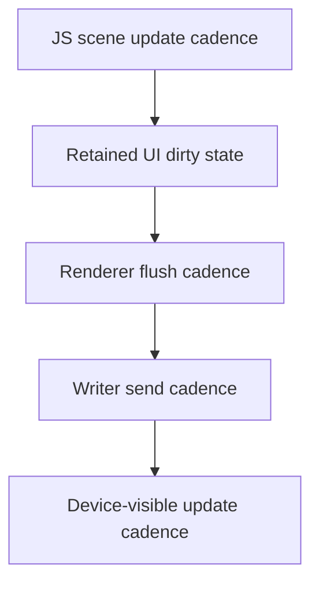

# Measuring layered animation density, pacing, and tuning for Loupedeck JS scenes

## Executive summary

This ticket exists because the current Loupedeck JavaScript runtime has crossed an important threshold: it now supports retained display regions, retained graphics surfaces, ordered overlay layers, and a hardware-validated animated scene prototype. Once a scene becomes layered and continuously animated, subjective questions like "does it feel slow?" stop being good enough. We need a disciplined way to measure where time is going, what kind of work is increasing, and whether a visible slowdown is coming from JavaScript scene updates, Go-side composition, transport pacing, or the device itself.

The key architectural rule from the earlier tickets still applies here: JavaScript must not bypass Go-owned rendering or transport policy. That rule is not a limitation for this measurement work; it is the reason the work is tractable. Because Go still owns the renderer, invalidation scheduler, and writer, we have clean places to instrument the system and clear boundaries between different classes of cost.

The implementation direction in this ticket is therefore not "make the scene faster" in the abstract. It is:

- define what layered scene density means in this codebase,
- expose measurements at the scene, renderer, and writer layers,
- run controlled density sweeps on real hardware,
- and only then decide whether any tuning changes are justified.

## Why this ticket exists

The current layered prototype already produced the first useful user question: are the ripple effects all supposed to have the same duration and speed, or is the device slowing down? That question is exactly the kind of ambiguity this ticket is meant to eliminate.

Without dedicated measurement, several very different situations can look similar:

- a frame-step-based effect can look inconsistent even if the device is healthy,
- the renderer can be doing more composition work even if the writer queue is fine,
- the writer queue can be backing up even if JS scene updates are cheap,
- the hardware can be at its transport limit even if CPU-side work is minimal,
- and user-visible response can feel laggy even when average throughput looks good.

This ticket creates the design and runbook for separating those cases cleanly.

## What "layered density affects pacing" actually means

In this repository, "layered density" is not just a vague artistic notion. It has concrete technical meaning. A scene becomes denser when one or more of the following increase:

- the number of retained display regions participating in the scene,
- the number of retained surfaces per display,
- the number of named overlay layers above a base surface,
- the fraction of each surface that changes every update,
- the frequency at which those surfaces change,
- the amount of scene state churn causing repeated dirty invalidations,
- or the amount of device traffic created by all of the above.

So when we ask whether layered density affects pacing, we are really asking several sub-questions:

- Does more scene complexity slow down JS-side scene updates?
- Does more layering increase Go-side composition time?
- Does more animated surface area increase writer queue pressure?
- Does the device remain responsive to touch/button input under those conditions?
- Are any visible timing differences caused by real workload changes, or just by the current effect design?

## Current architecture baseline

Before an intern can measure pacing, they need to know where the moving parts are.

### Scene and UI ownership

Relevant files:

- `/home/manuel/code/wesen/2026-04-11--loupedeck-test/runtime/ui/display.go`
- `/home/manuel/code/wesen/2026-04-11--loupedeck-test/runtime/ui/page.go`
- `/home/manuel/code/wesen/2026-04-11--loupedeck-test/runtime/ui/ui.go`

The retained UI model currently owns:

- pages,
- named displays (`left`, `main`, `right`),
- a base surface per display,
- named overlay layers per display,
- tile compatibility on `main`,
- dirty tracking for displays and tiles.

This is the scene-ownership layer. It answers the question: *what needs to be redrawn?*

### Graphics substrate

Relevant files:

- `/home/manuel/code/wesen/2026-04-11--loupedeck-test/runtime/gfx/surface.go`
- `/home/manuel/code/wesen/2026-04-11--loupedeck-test/runtime/gfx/text.go`

The graphics layer owns retained grayscale/additive surfaces and their coarse operations:

- clear,
- fillRect,
- line,
- crosshatch,
- text,
- additive compositing.

This is the raster-building layer. It answers the question: *what is in the scene’s retained surfaces right now?*

### JS runtime and scene authoring layer

Relevant files:

- `/home/manuel/code/wesen/2026-04-11--loupedeck-test/runtime/js/runtime.go`
- `/home/manuel/code/wesen/2026-04-11--loupedeck-test/runtime/js/module_ui/module.go`
- `/home/manuel/code/wesen/2026-04-11--loupedeck-test/runtime/js/module_gfx/module.go`
- `/home/manuel/code/wesen/2026-04-11--loupedeck-test/examples/js/07-cyb-ito-prototype.js`

The JS side owns scene description and retained scene mutation, but not transport. It answers the question: *what scene changes should happen over time or in response to input?*

### Retained composition and flush layer

Relevant files:

- `/home/manuel/code/wesen/2026-04-11--loupedeck-test/runtime/render/visual_runtime.go`
- `/home/manuel/code/wesen/2026-04-11--loupedeck-test/cmd/loupe-js-live/main.go`

This layer composites retained display surfaces and layers, converts them into output images, and flushes dirty retained content to hardware displays. It answers the question: *how often are we actually turning retained scene state into outbound images?*

### Lower transport and pacing ownership

Relevant files:

- `/home/manuel/code/wesen/2026-04-11--loupedeck-test/writer.go`
- `/home/manuel/code/wesen/2026-04-11--loupedeck-test/renderer.go`
- `/home/manuel/code/wesen/2026-04-11--loupedeck-test/display.go`
- `/home/manuel/code/wesen/2026-04-11--loupedeck-test/connect.go`

This layer owns the write queue, pacing interval, grouping, and lower protocol behavior. It answers the question: *can the device path keep up with the flushes the retained scene wants to perform?*

### Existing raw-ceiling benchmark

Relevant file:

- `/home/manuel/code/wesen/2026-04-11--loupedeck-test/cmd/loupe-fps-bench/main.go`

This benchmark already tells us something important: the raw device path has different ceilings depending on screen region and workload. That is the transport/display baseline. It is useful, but it does **not** tell us how a layered retained JS scene behaves in practice.

## Measurement model: four distinct clocks

A very important mental model for a new intern is that this system effectively has four clocks.



Each clock can drift or bottleneck independently:

- JS can update slowly even if the renderer and writer are fine.
- The renderer can flush slowly even if JS updates are cheap.
- The writer can back up even if composition is fast.
- The device can visibly lag even if upstream averages look acceptable.

This is why the measurement plan must instrument several layers at once.

## Measurement goals

This ticket should eventually produce answers to all of the following:

### Functional questions

- Do layered scenes continue to react correctly under load?
- Does input remain visible and responsive during dense animation?
- Are certain layer combinations visibly unstable?

### Quantitative questions

- How many scene updates per second are we actually performing?
- How many renderer flushes per second are we actually performing?
- How many displays are flushed per cycle?
- How much time does composition take per display/flush?
- Does the writer queue grow under layered load?
- Does queue growth correlate with visible lag?

### Decision questions

- Is the current default `flush-interval` too aggressive or too conservative?
- Is the current default `send-interval` too aggressive or too conservative?
- Should the live runner expose more pacing controls or diagnostics?
- Should certain overlay patterns be coalesced or redrawn less often?
- Is a later ack-gated transport mode warranted, or is current pacing enough?

## Important distinction: raw hardware ceiling vs retained-scene behavior

One of the most important design rules from earlier tickets must be repeated here because it changes how the results are interpreted.

Raw hardware throughput and retained-scene throughput are not the same metric.

### Raw hardware ceiling tells us

- how fast the device and protocol path can move images in idealized conditions,
- what the display transport limits look like for main vs side displays,
- and what the writer can achieve without a rich retained runtime sitting above it.

### Retained-scene behavior tells us

- whether scene authoring patterns are too expensive,
- whether composition work is efficient,
- whether layer count or overdraw is causing pressure,
- whether user-facing input response stays acceptable,
- and whether the chosen pacing defaults are appropriate.

The ticket must not conflate those.

## What should be measured

### 1. Scene update statistics

These belong near the live script execution path.

Suggested metrics:

- scene update ticks per second,
- activations per second,
- current layer count per display,
- scene mode / workload label.

Why they matter:

- They tell us whether the JS scene itself is updating consistently.
- They help distinguish event storms from normal animation.

### 2. Renderer statistics

These belong near `runtime/render/visual_runtime.go` and/or the live runner around `renderer.Flush()`.

Suggested metrics:

- flushes per second,
- number of dirty displays flushed per second,
- number of dirty tiles flushed per second,
- average render/composition time per flush,
- max render/composition time per flush,
- per-display composition counts (`left`, `main`, `right`).

Why they matter:

- They tell us how much work the retained renderer is actually doing.
- They help isolate Go-side composition cost from transport cost.

### 3. Writer statistics

These belong near the existing writer stats path in `writer.go` and should be surfaced periodically by the live runner.

Suggested metrics:

- queued commands,
- sent commands,
- sent messages,
- failed commands,
- max queue depth,
- optional current queue depth snapshot.

Why they matter:

- They tell us whether the retained scene is producing more work than the lower send path can absorb.
- They are the clearest current signal of transport-side stress before a visible failure occurs.

### 4. Interaction latency observations

This is partly qualitative, but still important.

Suggested capture:

- touch event timestamp in log,
- scene-side activation timestamp in log,
- note from human observer about whether visible feedback felt immediate,
- whether response stays stable across repeated taps.

Why they matter:

- A system with acceptable average throughput can still feel bad if input feedback is bursty or delayed.

## What should not be done

The easiest way to get misleading numbers is to measure the wrong thing.

Avoid these anti-patterns:

- measuring only average FPS and calling it done,
- measuring only JS update cadence without renderer/writer context,
- measuring only writer stats without knowing whether the scene changed much,
- changing multiple pacing parameters at once and then drawing conclusions,
- benchmarking a visually different scene for each condition,
- or using a frame-step-based effect and then blaming the device for its inconsistency.

## Proposed instrumentation design

## Renderer-side stats structure

A small stats structure can be added near the retained renderer or live runner.

Pseudocode:

```go
type FlushStats struct {
    FlushCount           uint64
    FlushedDisplays      uint64
    FlushedTiles         uint64
    TotalRenderNanos     uint64
    MaxRenderNanos       uint64
    DisplayFlushCount    map[string]uint64
}
```

Example update path:

```go
start := time.Now()
flushedDisplays := len(displays)
flushedTiles := len(tiles)
renderer.Flush()
elapsed := time.Since(start)

stats.FlushCount++
stats.FlushedDisplays += uint64(flushedDisplays)
stats.FlushedTiles += uint64(flushedTiles)
stats.TotalRenderNanos += uint64(elapsed)
if elapsed > stats.MaxRender {
    stats.MaxRender = elapsed
}
```

Periodic logging example:

```go
slog.Info("renderer stats",
    "flushes", flushesThisWindow,
    "displays", displaysThisWindow,
    "tiles", tilesThisWindow,
    "avg_render_ms", avgRenderMs,
    "max_render_ms", maxRenderMs,
)
```

## Live-runner stats loop

The cleanest initial implementation is probably to keep the instrumentation in `cmd/loupe-js-live/main.go` first, rather than prematurely pushing all stats plumbing into lower packages.

Why:

- It is the current measurement surface for real JS scenes.
- It already owns the flush ticker.
- It already has access to the runtime and deck connection.
- It is easier to iterate there before designing reusable stats APIs.

### Suggested flags

Potential new flags:

- `--log-render-stats`
- `--stats-interval 1s`
- `--scene-mode base|hud|scan|ripple|full`
- `--log-writer-stats`
- `--log-scene-stats`

### Suggested periodic window report

```text
renderer stats flushes=18 displays=54 tiles=0 avg_render_ms=2.1 max_render_ms=5.7
writer stats queued=120 sent_commands=120 sent_messages=180 failed=0 max_queue_depth=3
scene stats updates=18 activations=4 mode=full layers_main=3
```

## Scene-density sweep design

The current prototype scene is the right seed workload because it already exercises:

- layered main display composition,
- animated side strips,
- touch-driven overlays,
- and real user-visible status feedback.

The next measurement work should not jump straight to an arbitrary synthetic stress tool. It should first turn the prototype into a controlled density sweep.

### Recommended scene modes

- `base`
  - base scene only
- `hud`
  - base + HUD layer
- `scan`
  - base + scan layer
- `ripple`
  - base + ripple layer
- `main-full`
  - base + scan + ripple + HUD on main only
- `full`
  - main full + left strip + right strip

This keeps the workload constant in spirit while changing one complexity axis at a time.

## Experiment matrix

A good first matrix is intentionally small.

### Dimension 1: scene density

- `base`
- `hud`
- `scan`
- `ripple`
- `main-full`
- `full`

### Dimension 2: flush cadence

- `16ms`
- `33ms`
- `50ms`

### Dimension 3: writer pacing

- `35ms`
- `20ms`
- `10ms`

Do **not** sweep everything at once initially. Start with:

1. fix writer pacing at current default,
2. vary scene density,
3. then vary flush cadence,
4. and only then test writer pacing variants.

## How results should be interpreted

### Case A: renderer time rises, queue stays calm

Likely conclusion:

- composition cost is rising,
- but transport is not yet the bottleneck.

Possible next steps:

- reduce unnecessary redraw area,
- split static vs dynamic layers more clearly,
- avoid rebuilding layers that did not change.

### Case B: queue depth rises, renderer time stays fine

Likely conclusion:

- transport/write pacing is the bottleneck,
- not Go-side composition.

Possible next steps:

- reduce flush cadence,
- reduce update area or frequency,
- reassess writer pacing defaults,
- later consider stricter transport gating if truly needed.

### Case C: both renderer time and queue depth rise

Likely conclusion:

- the scene is simply denser on both sides,
- and optimization needs to happen at several layers.

Possible next steps:

- reduce layer churn,
- avoid touching multiple full-size layers every frame,
- measure per-layer change patterns,
- and consider a more selective invalidation policy later.

### Case D: numbers look fine, but humans still perceive inconsistency

Likely conclusion:

- effect design may be frame-step-based or visually ambiguous,
- or the metrics are missing latency distribution/jitter.

Possible next steps:

- convert effects to time-normalized tweens,
- add event-to-feedback tracing,
- log per-window min/max cadence rather than just averages.

## Why ripple duration currently feels suspicious

This is worth documenting because it directly motivated the ticket.

The current prototype’s ripple and flash are decremented per update tick rather than driven by explicit time-based tweens. That means they are not guaranteed to have the same wall-clock duration when update cadence varies.

Current pattern:

```javascript
ripple.set(Math.max(0, ripple.get() - 0.08));
flash.set(Math.max(0, flash.get() - 0.12));
```

This means apparent duration depends on how often the update loop runs. So one of the first tuning tasks after instrumentation should be to separate:

- effect-design inconsistency,
- from genuine layered workload slowdown.

A likely follow-up is to drive ripple/flash with fixed-duration `anim.to(...)` tweens instead.

## Suggested implementation order

### Phase A: documentation and runbook

Deliverables:

- this design doc,
- a playbook for running density sweeps,
- ticket tasks and diary.

### Phase B: live-runner instrumentation

Implement in:

- `/home/manuel/code/wesen/2026-04-11--loupedeck-test/cmd/loupe-js-live/main.go`

Goals:

- periodic renderer stats logging,
- periodic writer stats logging,
- scene mode labels in logs.

### Phase C: prototype workload modes

Implement in:

- `/home/manuel/code/wesen/2026-04-11--loupedeck-test/examples/js/07-cyb-ito-prototype.js`

Goals:

- controlled density flags or variants,
- stable comparison across modes.

### Phase D: controlled hardware sweep

Use tmux-based runs with:

- fixed durations,
- logged stats windows,
- documented hardware observations,
- separate notes for visible responsiveness.

### Phase E: interpretation and tuning recommendations

Only after measured evidence exists should the team decide whether to:

- change `flush-interval`,
- change `send-interval`,
- change scene redraw strategy,
- or leave defaults alone.

## Implementation sketches

### Sketch 1: renderer stats in live runner

```go
statsTicker := time.NewTicker(*statsInterval)
defer statsTicker.Stop()

for {
    select {
    case <-flushTicker.C:
        start := time.Now()
        flushed := renderer.Flush()
        renderStats.RecordFlush(flushed, time.Since(start))
        if *logWriterStats {
            writerStats.Record(deckConn.WriterStats())
        }
    case <-statsTicker.C:
        slog.Info("scene pacing stats",
            "scene_mode", *sceneMode,
            "flushes", renderStats.FlushesInWindow(),
            "avg_render_ms", renderStats.AvgRenderMs(),
            "max_render_ms", renderStats.MaxRenderMs(),
            "writer_max_queue_depth", deckConn.WriterStats().MaxQueueDepth,
        )
        renderStats.ResetWindow()
    }
}
```

### Sketch 2: density modes in prototype script

```javascript
const MODE = globalThis.__sceneMode || "full";

if (MODE === "base") {
  display.layer("scan", null);
  display.layer("ripple", null);
  display.layer("hud", null);
}
```

A more production-worthy version might expose the mode as a CLI-injected global or via a small environment/config module later.

## Review-critical risks

These deserve a second pair of eyes when implementation begins.

### Risk 1: logging overhead distorts results

If we log too aggressively, the measurement system changes the thing being measured.

Mitigation:

- aggregate in memory,
- log once per second,
- keep hot-path allocations minimal.

### Risk 2: averages hide jitter

A scene can have acceptable average flush rate but terrible worst-case pauses.

Mitigation:

- always track max values,
- later consider percentile windows if needed.

### Risk 3: scene variants are not comparable

If each mode changes too many artistic features at once, the benchmark becomes a taste comparison instead of a workload comparison.

Mitigation:

- vary one complexity dimension at a time,
- preserve scene structure where possible.

### Risk 4: raw hardware benchmark results get over-applied

The raw benchmark is useful but not a direct answer to retained-scene behavior.

Mitigation:

- always report raw-ceiling and retained-scene findings separately.

## Anti-patterns and working rules

### Anti-patterns

- Do not claim a pacing problem from subjective feel alone.
- Do not change both scene density and writer pacing at once and then blame whichever result looks worse.
- Do not use JS per-pixel loops as a measurement shortcut.
- Do not expose raw transport timing knobs directly into unowned JS scene code.

### Working rules

- Keep measurement ownership in Go.
- Keep scene authorship in JS.
- Keep transport policy in Go.
- Measure one axis at a time.
- Prefer real hardware runs over simulated confidence.

## Recommended deliverables for the future implementation ticket work

When this ticket is actually implemented later, the end state should include:

- a stats-enabled live runner,
- a repeatable density sweep mode for the prototype scene,
- a hardware evidence log set,
- a short interpretation report with tables or bullet summaries,
- and, only if warranted, a separate tuning commit that changes defaults or invalidation behavior.

## Quick-reference checklist for a new intern

Before writing code:

- read `cmd/loupe-js-live/main.go`
- read `runtime/render/visual_runtime.go`
- read `writer.go`
- read `cmd/loupe-fps-bench/main.go`
- read `examples/js/07-cyb-ito-prototype.js`

Before drawing conclusions:

- separate raw hardware ceilings from retained scene behavior
- separate effect-design timing from actual pacing issues
- capture renderer stats and writer stats together
- test on real hardware

Before proposing tuning changes:

- show the measured problem clearly
- show which layer is responsible
- explain why the proposed change addresses that layer specifically

## Final recommendation

The next real engineering step after this documentation is not broad optimization. It is disciplined instrumentation plus a small density-sweep harness around the existing layered prototype. Only after that data exists should the project decide whether there is a renderer issue, a writer issue, a scene-authoring issue, or mostly an effect-design issue.
