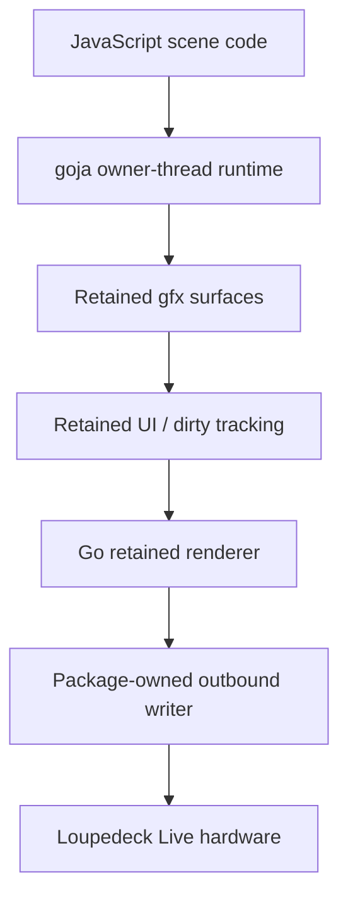
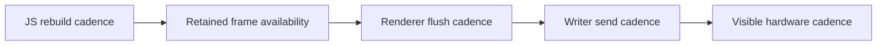

# Project technical report — making the 12-tile JavaScript canvas cyb-ito port performant

## Executive summary

This report explains the performance investigation around the cyb-ito-inspired JavaScript canvas port for the Loupedeck Live. The key problem is deceptively simple to state: we want a `4x3` grid of animated `90x90` tiles, inspired by the imported `cyb-ito.html` reference, to feel responsive and visually coherent on real hardware. In practice, the system is not one monolithic renderer. It is a chain of separate stages: JavaScript scene logic, goja/native-call boundaries, retained grayscale surfaces, Go-side composition, package-owned writer pacing, and finally a fragile serial-WebSocket device path.

The most important result of the work so far is that we have already ruled out several wrong explanations. The current slowdown is not just "JavaScript is slow" in the abstract. It is also not simply "the hardware cannot keep up." Earlier raw hardware benchmarks showed a much higher display ceiling than the live scene was achieving. Later instrumentation showed that the full-page scene can rebuild in JavaScript on the order of tens of milliseconds, while the actual visible full-page flush cadence can still collapse to roughly one meaningful flush per second-scale window. That is a very different failure mode from simple queue saturation.

The current best explanation is that performance depends on *which unit of work we optimize* and *which clock we are actually measuring*. In tile mode, command count dominates because the writer is paced per command and a 12-tile frame can become 12 separate sends. In full-page mode, command count improves dramatically, but scene rebuild cadence and frame availability become the main problem, especially when a shared retained surface is rebuilt almost continuously. The right next steps are therefore not random micro-optimizations. They are targeted experiments around scene cadence, frame availability, and potentially stronger full-page snapshot/swap semantics.

## Why this report exists

This report exists because the project has already passed the stage where a short diary entry is enough. We now have multiple concrete implementation branches, real hardware evidence, working instrumentation, and several hypotheses that have been partially confirmed or disproven. Without a proper technical report, a future intern would be forced to re-derive the architecture and repeat the same false starts.

The purpose of this report is not just to summarize what changed. It is to explain:

- what the system is,
- why the problem is tricky,
- which approaches were tried,
- what each approach taught us,
- what the live measurements actually mean,
- and which next experiments are worth spending time on.

## Problem statement

The current performance question can be stated precisely:

> How do we make the cyb-ito-inspired JavaScript `4x3` tile scene visually coherent and responsive on real Loupedeck Live hardware while preserving the current architectural rule that Go owns rendering/transport policy and JavaScript only mutates retained scene state?

That question breaks into several sub-questions:

- Is per-tile flushing or full-page flushing the better unit of work?
- How much of the current slowdown is command-count bound versus scene-build bound?
- How much of the current slowdown is writer pacing versus retained-frame availability?
- Are we observing transport saturation, renderer starvation, or continuous JS-side rebuild pressure?
- Which parts of the tile art belong in JS loops, and which parts should eventually move to coarser Go-native helpers?

## The source artifact and hardware target

The source artifact is:

- `/home/manuel/code/wesen/2026-04-11--loupedeck-test/ttmp/2026/04/11/LOUPE-006--full-animated-javascript-uis-for-loupedeck-from-cyb-ito-html-reference/sources/local/cyb-ito.html`

Earlier analysis established that the artifact is a single-canvas procedural scene with:

- one animated grayscale raster,
- a `4x3` main tile grid,
- browser-side scene-wide effects,
- and additional strip content.

The hardware target is the Loupedeck Live with:

- main display: `360x270`
- left strip: `60x270`
- right strip: `60x270`
- visible tile grid: `4x3`
- tile geometry: `90x90`

Important adaptation rules discovered during the porting work:

- the source tile semantics map cleanly to `90x90` hardware tiles,
- hardware strips should be treated as `60px` wide,
- the visible tile art should be shifted down by about `3px` because of the bezel,
- monochrome evaluation is preferred during fidelity work,
- and Go must continue to own the lower display/writer policy.

## Architecture baseline — what the system actually is

A new intern should think of the current runtime as a layered system with several independently observable clocks.



### JavaScript scene layer

Relevant files:

- `/home/manuel/code/wesen/2026-04-11--loupedeck-test/examples/js/08-cyb-ito-tile-port-first3.js`
- `/home/manuel/code/wesen/2026-04-11--loupedeck-test/examples/js/09-cyb-ito-tile-port-all12.js`
- `/home/manuel/code/wesen/2026-04-11--loupedeck-test/examples/js/10-cyb-ito-full-page-all12.js`

This layer decides:

- what tile art to draw,
- how often to rebuild,
- which inputs trigger scene changes,
- and which retained surfaces are mutated.

### goja ownership layer

Relevant files:

- `/home/manuel/code/wesen/2026-04-11--loupedeck-test/runtime/js/runtime.go`
- `/home/manuel/code/wesen/2026-04-11--loupedeck-test/pkg/runtimeowner/runner.go`
- `/home/manuel/code/wesen/2026-04-11--loupedeck-test/pkg/runtimebridge/runtimebridge.go`

This layer ensures:

- JavaScript executes on an owner thread,
- callbacks settle back onto that owner thread,
- runtime-scoped values are attached through `runtimebridge`,
- and modules can resolve their dependencies without global state.

### Retained graphics layer

Relevant files:

- `/home/manuel/code/wesen/2026-04-11--loupedeck-test/runtime/gfx/surface.go`
- `/home/manuel/code/wesen/2026-04-11--loupedeck-test/runtime/gfx/text.go`

This layer owns:

- grayscale additive surfaces,
- low-level drawing operations,
- batching semantics,
- and snapshot conversion to RGBA.

### Retained UI and flush layer

Relevant files:

- `/home/manuel/code/wesen/2026-04-11--loupedeck-test/runtime/ui/ui.go`
- `/home/manuel/code/wesen/2026-04-11--loupedeck-test/runtime/ui/display.go`
- `/home/manuel/code/wesen/2026-04-11--loupedeck-test/runtime/ui/tile.go`
- `/home/manuel/code/wesen/2026-04-11--loupedeck-test/runtime/render/visual_runtime.go`

This layer decides:

- what is dirty,
- whether a dirty thing is a display or a tile,
- how to convert retained state into `image.Image` draws,
- and how many logical hardware draw operations a flush will perform.

### Writer and transport layer

Relevant files:

- `/home/manuel/code/wesen/2026-04-11--loupedeck-test/writer.go`
- `/home/manuel/code/wesen/2026-04-11--loupedeck-test/display.go`
- `/home/manuel/code/wesen/2026-04-11--loupedeck-test/connect.go`

This layer owns:

- per-command queueing,
- send pacing,
- lower WebSocket-over-serial writes,
- and connection lifecycle.

The important detail for this report is that the writer is currently paced *per outbound command*, not per byte-budget or per display area.

## Four clocks that must not be conflated

The performance problem is hard because the system has at least four distinct clocks.



These clocks are not equivalent.

- JS rebuild cadence asks: how often is the scene trying to build a new frame?
- Retained frame availability asks: how often is there a stable surface snapshot worth flushing?
- Renderer flush cadence asks: how often does the Go side actually flush something?
- Writer send cadence asks: how often can commands be sent under the current pacing rules?
- Visible hardware cadence asks: how often does the human actually see a meaningfully new frame?

A major theme of this project is that each experimental branch tended to improve one clock while exposing a new bottleneck in another.

## Approach 1 — understand the raw transport ceiling first

Before performance hypotheses about the JS scene could be trusted, the project measured the raw hardware/display path separately.

Relevant file:

- `/home/manuel/code/wesen/2026-04-11--loupedeck-test/cmd/loupe-fps-bench/main.go`

Important earlier results:

- full main display `360x270`: about `36 FPS` stable
- single tile `90x90`: about `314 FPS` practical ceiling
- 12-tile aggregate: about `288 FPS` stable aggregate

### Why this mattered

These numbers immediately prevented one common mistake: blaming the hardware too early. The device path is not infinitely fast, but it is also not inherently limited to the very slow visible behavior observed in the later JS scene experiments.

### What this approach did not answer

These benchmarks did **not** answer:

- how expensive the JS scene is to build,
- how often the retained renderer can obtain a coherent frame,
- or how the current writer pacing policy interacts with tile mode versus full-page mode.

Still, this baseline was critical because it let later experiments distinguish “transport ceiling” from “current runtime policy.”

## Approach 2 — per-tile subimage blits for fidelity work

The first serious cyb-ito tile-fidelity branch focused on true tile-sized updates.

Relevant files:

- `/home/manuel/code/wesen/2026-04-11--loupedeck-test/runtime/ui/tile.go`
- `/home/manuel/code/wesen/2026-04-11--loupedeck-test/runtime/render/visual_runtime.go`
- `/home/manuel/code/wesen/2026-04-11--loupedeck-test/examples/js/08-cyb-ito-tile-port-first3.js`
- `/home/manuel/code/wesen/2026-04-11--loupedeck-test/examples/js/09-cyb-ito-tile-port-all12.js`

This branch added:

- tile-owned `gfx.Surface` attachment,
- JS `tile.surface(surface)` support,
- and renderer behavior that flushes each tile surface as a `90x90` draw.

### Why this approach was attractive

It aligned naturally with the source tile model.

- Each tile is a retained subimage.
- Each tile can be tuned and debugged independently.
- It is a natural fit for future selective updates.
- It matches the real tile geometry on hardware.

### What it revealed

The tile-mode branch made command-count costs brutally obvious.

Under the current writer pacing defaults:

- `send-interval = 35ms`
- therefore max commands/sec is about `1000 / 35 ≈ 28.6`

If a “frame” means updating all 12 tiles, and each tile is a separate command, then the best-case full-grid rate is roughly:

- `28.6 / 12 ≈ 2.4 full-grid frames/sec`

That math matched the subjective slowness extremely well.

### Key lesson from tile mode

Per-tile work is not automatically fast just because each tile is small. Under *per-command* pacing, tile mode can lose badly because a single visible full-grid update explodes into many commands.

### Useful conclusion

Tile mode remains valuable for:

- fidelity debugging,
- targeted tile tuning,
- and future selective redraw strategies,

but under the current conservative writer policy it is a poor default for full-grid animation.

## Approach 3 — one full-page redraw instead of twelve tile redraws

To test the opposite strategy, the project created a full-page retained scene that draws all 12 tiles into one `360x270` surface.

Relevant file:

- `/home/manuel/code/wesen/2026-04-11--loupedeck-test/examples/js/10-cyb-ito-full-page-all12.js`

### Why this approach was attractive

It compresses one visible frame into one outbound command instead of twelve.

Under the same `35ms` send interval:

- tile mode: about `2.4` full-grid frames/sec best case
- full-page mode: potentially about `28.6` full-page commands/sec best case

That was a strong reason to test it.

### What went wrong at first

The first full-page branch showed a weird visual artifact:

- earlier tiles looked more reliable,
- later tiles appeared only on some frames,
- the scene looked corrupted in a directional way.

That symptom was important because it did **not** look like ordinary queue pressure.

## Approach 4 — fix frame atomicity with surface batching

The first full-page artifact turned out not to be “generic slowness.” The renderer was snapshotting the shared `main` surface while JavaScript was still inside `renderAll()`.

Relevant files:

- `/home/manuel/code/wesen/2026-04-11--loupedeck-test/runtime/gfx/surface.go`
- `/home/manuel/code/wesen/2026-04-11--loupedeck-test/runtime/gfx/text.go`
- `/home/manuel/code/wesen/2026-04-11--loupedeck-test/runtime/js/module_gfx/module.go`
- `/home/manuel/code/wesen/2026-04-11--loupedeck-test/examples/js/10-cyb-ito-full-page-all12.js`

### Fix implemented

The graphics layer gained:

- `Surface.Batch(func())`
- coalesced change notifications
- stable read behavior during in-flight batches
- JS `surface.batch(() => { ... })`

The full-page scene then wrapped `renderAll()` in one batch.

### Result

This fixed the “later tiles only appear some frames” problem. After batching, the user observed:

- all tiles are there,
- but updates are still **extremely slow**.

### Key lesson from batching

Before talking about speed, we first had to talk about *coherent frames*. A retained scene can be slow for many reasons, but a scene that is not frame-atomic is not even producing a trustworthy workload to measure.

## Approach 5 — instrument from both Go and JavaScript

Once the scene was coherent, the next step was instrumentation.

Relevant files:

- `/home/manuel/code/wesen/2026-04-11--loupedeck-test/runtime/metrics/metrics.go`
- `/home/manuel/code/wesen/2026-04-11--loupedeck-test/pkg/jsmetrics/jsmetrics.go`
- `/home/manuel/code/wesen/2026-04-11--loupedeck-test/cmd/loupe-js-live/main.go`
- `/home/manuel/code/wesen/2026-04-11--loupedeck-test/examples/js/10-cyb-ito-full-page-all12.js`

The live runner gained periodic stats logging for:

- renderer flush windows,
- writer deltas and current queue depth,
- JS-side metrics snapshots.

The JS scene gained counters and timings for:

- loop ticks,
- rebuild calls,
- rebuild reasons,
- per-tile draw timings,
- activation reasons.

### Why inside-JS instrumentation mattered

Without JS-side timing, we could only infer scene cost indirectly. The project needed to know whether the expensive part was:

- the JS scene itself,
- the JS-to-Go drawing calls,
- the renderer snapshot path,
- or the writer queue.

## Evidence from the first combined stats run

Evidence log:

- `/tmp/loupe-cyb-ito-full10-stats-1776020694.log`

The first combined run gave the most useful evidence yet.

### Observed JS-side numbers

Approximate values from the log:

- `scene.loopTicks = 72..77` per one-second window
- `scene.renderAll.calls = 72..78` per one-second window
- `scene.renderAll avg = 18..22 ms`
- hottest tile:
  - `scene.tile.SPIRAL avg ≈ 5..6 ms`

### Observed Go-side render numbers

Approximate values from the log:

- only one non-empty full-page flush in a stats window
- flush durations around `1.1–1.5 s`

### Observed writer numbers

Approximate values from the log:

- one command sent in the same window
- queue depth remained `0`

### Immediate interpretation

This ruled out several simple explanations.

#### What the data does **not** support

- It does **not** support “writer queue backing up under load.” Queue depth stayed zero.
- It does **not** support “transport is obviously maxed out by command count,” because full-page mode only sends one command per meaningful flush.
- It does **not** support “JavaScript alone explains multi-second visual lag,” because `renderAll()` was expensive but not multi-second expensive.

#### What the data *does* support

The most plausible current explanation is:

- JavaScript rebuilds the shared full-page surface almost continuously,
- each rebuild takes on the order of tens of milliseconds,
- the renderer can only occasionally obtain and flush a stable frame,
- and therefore visible updates collapse even though neither the raw hardware ceiling nor the writer queue looks obviously saturated.

## A useful mental model — rebuilds versus flushes

One of the most important distinctions in the current project is between a **rebuild** and a **rendered full page**.

### Rebuild

A rebuild means:

- `renderAll()` ran in JavaScript,
- the retained `main` surface was cleared and repainted,
- a change notification was emitted at batch end.

### Rendered full page

A rendered full page means:

- the Go renderer snapshot the stable retained surface,
- converted it to RGBA,
- called `Display.Draw(...)`,
- and the writer sent the full-page command to the device.

This distinction matters because the current stats strongly suggest that rebuilds are happening much more frequently than rendered full-page flushes.

### Pseudocode for the current pattern

```javascript
anim.loop(1400, t => {
  phase.set(t);
  renderAll("loop");
});
```

```javascript
function renderAll(reason) {
  sceneMetrics.recordRebuild(reason, () => {
    main.batch(() => {
      main.clear(0);
      for (let i = 0; i < 12; i++) {
        drawTile(i, ...);
      }
    });
  });
}
```

The renderer, meanwhile, runs on its own flush cadence and can only progress when it can obtain a stable snapshot worth sending.

## Current hypotheses

At this point the project has multiple evidence-backed hypotheses.

### Hypothesis 1 — per-command pacing makes full-grid tile mode inherently slow

**Status:** strongly supported

Reasoning:

- `09` turns one visible full-grid update into 12 commands.
- the writer is paced per command,
- so command count dominates.

### Hypothesis 2 — full-page mode solved command explosion but exposed frame-availability starvation

**Status:** strongly supported

Reasoning:

- `10` reduced the visible frame to one command,
- batching fixed incoherent frame snapshots,
- yet full-page updates still appear extremely slow,
- while JS rebuilds keep happening and the writer queue stays empty.

### Hypothesis 3 — the full-page scene is too eager; it rebuilds faster than the renderer can turn stable frames into hardware updates

**Status:** plausible and currently the leading hypothesis

Reasoning:

- loop ticks and rebuilds are very frequent,
- rebuild timing is tens of milliseconds,
- render flushes are much rarer,
- the queue is not backing up.

### Hypothesis 4 — JS-to-Go raster call density is still too high for the current scene shape

**Status:** supported, but likely not the only bottleneck

Reasoning:

- per-tile timings show real JS-side cost,
- especially on the more procedural tiles like `SPIRAL`,
- and many of these costs come from lots of small draw operations.

### Hypothesis 5 — a better full-page strategy may require stronger snapshot/swap semantics, not just batch semantics

**Status:** plausible

Reasoning:

- batching ensures coherent snapshots,
- but does not necessarily guarantee good frame availability under continuous rebuild pressure,
- a back-buffer/front-buffer model may offer better full-page behavior.

## Candidate strategies from here

The current report does not recommend one magic fix. It recommends a staged set of experiments.

### Strategy A — reduce scene rebuild cadence explicitly

Instead of rebuilding on every loop tick, rebuild at a lower or controlled cadence.

Pseudocode:

```javascript
let lastFrameMs = 0;
const targetFrameMs = 100;

anim.loop(1400, t => {
  const now = metrics.now();
  phase.set(t);
  if (now - lastFrameMs >= targetFrameMs) {
    lastFrameMs = now;
    renderAll("loop");
  }
});
```

Why it matters:

- It directly tests whether the renderer is being starved by excessive rebuild frequency.

### Strategy B — stagger or decimate non-active tile updates

Only redraw the active tile every loop tick, and redraw background tiles less often.

Pseudocode:

```javascript
if (activeTileChanged || frameNumber % 6 === 0) {
  redrawAllTiles();
} else {
  redrawOnlyActiveTile();
}
```

Why it matters:

- It preserves animation focus while reducing raster work dramatically.

### Strategy C — move hot patterns into coarser Go-native helpers

The most procedural tile patterns currently use lots of tiny JS/native calls. A future optimization path is to introduce coarser Go-native primitives or tile renderers.

Possible targets:

- spiral raster helpers,
- repeated radial loop helpers,
- branch/crack helpers,
- dense crosshatch/noise helpers.

Why it matters:

- It reduces goja/native-call overhead without giving JS raw transport control.

### Strategy D — add stronger full-page snapshot/swap semantics

Instead of repainting the same visible retained surface, build into a back buffer and swap once complete.

Conceptually:

```go
front := currentVisibleSurface
back := scratchSurface

build(back)
swap(front, back)
markDirty(front)
```

Why it matters:

- It may increase frame availability under continuous rebuild pressure.

### Strategy E — revisit writer pacing only after scene cadence is better understood

The project should be careful not to treat every slowdown as a pacing problem.

Why:

- tile mode was strongly pacing-sensitive,
- full-page mode currently looks more frame-availability sensitive,
- so reducing `send-interval` blindly may not solve the real bottleneck.

## Recommendation order for a future intern

A future intern should not jump straight to arbitrary optimization. The recommended order is:

1. **Keep the current instrumentation on.**
2. **Run cadence experiments first** on the full-page scene.
3. **Try selective/staggered redraw** strategies second.
4. **Only then** consider moving hot tile raster paths into coarser native helpers.
5. Treat **buffer-swap semantics** as a strong candidate if cadence reduction still leaves frame starvation.
6. Revisit **writer pacing** only with fresh evidence from those experiments.

## API references relevant to this work

### JS-side scene instrumentation

Current concrete runtime modules:

- `require("loupedeck/metrics")`
- `require("loupedeck/scene-metrics")`

Current reusable implementation underneath:

- `pkg/jsmetrics/jsmetrics.go`

### Host-side stats logging

Current live-runner flags:

- `--log-render-stats`
- `--log-writer-stats`
- `--log-js-stats`
- `--stats-interval`

Implementation:

- `/home/manuel/code/wesen/2026-04-11--loupedeck-test/cmd/loupe-js-live/main.go`

### Retained scene batching

JS API:

```javascript
surface.batch(() => {
  // many mutations
});
```

Implementation:

- `/home/manuel/code/wesen/2026-04-11--loupedeck-test/runtime/gfx/surface.go`
- `/home/manuel/code/wesen/2026-04-11--loupedeck-test/runtime/js/module_gfx/module.go`

## Review checklist for a new intern

If you are picking this problem up for the first time, use this order.

1. Read this report completely.
2. Read the main LOUPE-007 design doc:
   - `design/01-textbook-measuring-layered-animation-density-pacing-and-tuning-for-loupedeck-js-scenes.md`
3. Read the diary:
   - `reference/01-implementation-diary.md`
4. Inspect the concrete scene branches:
   - `examples/js/08-cyb-ito-tile-port-first3.js`
   - `examples/js/09-cyb-ito-tile-port-all12.js`
   - `examples/js/10-cyb-ito-full-page-all12.js`
5. Inspect the current retained surface and renderer implementation:
   - `runtime/gfx/surface.go`
   - `runtime/render/visual_runtime.go`
6. Inspect the live stats runner:
   - `cmd/loupe-js-live/main.go`
7. Read the first evidence log:
   - `/tmp/loupe-cyb-ito-full10-stats-1776020694.log`

## Practical conclusions as of now

The current project state supports these conclusions with reasonable confidence:

- tile-mode full-grid animation is dominated by command count under the current writer pacing policy,
- full-page mode fixed that command explosion but exposed frame-construction and frame-availability problems,
- frame atomicity was a real bug and is now fixed,
- the current full-page slowdown is not well explained by writer queue pressure,
- JS scene construction is expensive but not obviously the sole explanation for the multi-second visible cadence,
- and the most valuable next experiments are cadence control, selective redraw, and possibly stronger full-page snapshot/swap semantics.

## Troubleshooting

| Problem | Cause | Solution |
|---|---|---|
| Tile mode feels unexpectedly slow even though raw tile benchmarks were fast | The writer is paced per command, so a 12-tile frame becomes 12 paced commands | Compare against full-page mode and compute full-grid rate from commands/sec rather than raw tile FPS alone |
| Full-page mode shows later tiles only on some frames | The renderer is snapshotting the shared retained surface while `renderAll()` is still painting it | Use `surface.batch(() => ...)` and keep stable-read semantics in `runtime/gfx/surface.go` |
| Full-page mode has all tiles but still feels extremely slow | Frame atomicity is fixed, but frame availability is still poor under continuous rebuild pressure | Use the current render/writer/JS stats path before changing pacing blindly |
| JS stats suggest `renderAll()` is only ~20ms but visible updates are much slower | Rebuild cadence and visible flush cadence are different clocks | Count rebuilds separately from non-empty full-page flushes and reason about frame availability |
| Writer queue stays empty but the scene still looks blocked | The system may be stalled before the writer, for example in renderer snapshot timing or frame-availability gaps | Do not treat queue depth alone as the whole truth; read render and JS stats together |
| A future optimization seems promising but hard to trust | The project has already had several plausible-sounding but incomplete explanations | Re-run the controlled stats workflow and record a new evidence log before committing to a major rewrite |

## See Also

- `design/01-textbook-measuring-layered-animation-density-pacing-and-tuning-for-loupedeck-js-scenes.md` — Primary measurement/tuning architecture guide for this ticket
- `playbooks/01-layered-density-measurement-runbook.md` — Operational runbook for future sweeps
- `reference/01-implementation-diary.md` — Chronological detail behind the slices summarized in this report
- `/home/manuel/code/wesen/2026-04-11--loupedeck-test/examples/js/09-cyb-ito-tile-port-all12.js` — Best reference for the command-count-heavy tile branch
- `/home/manuel/code/wesen/2026-04-11--loupedeck-test/examples/js/10-cyb-ito-full-page-all12.js` — Best reference for the full-page branch and current instrumentation usage
- `/home/manuel/code/wesen/2026-04-11--loupedeck-test/docs/help/topics/02-reusable-goja-js-metrics-subpackage.md` — Standalone guide for the reusable JS metrics binding and how to integrate it into other goja runtimes
