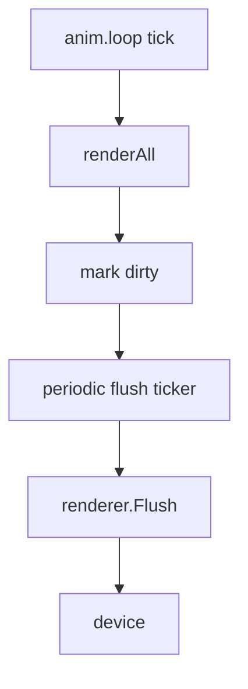
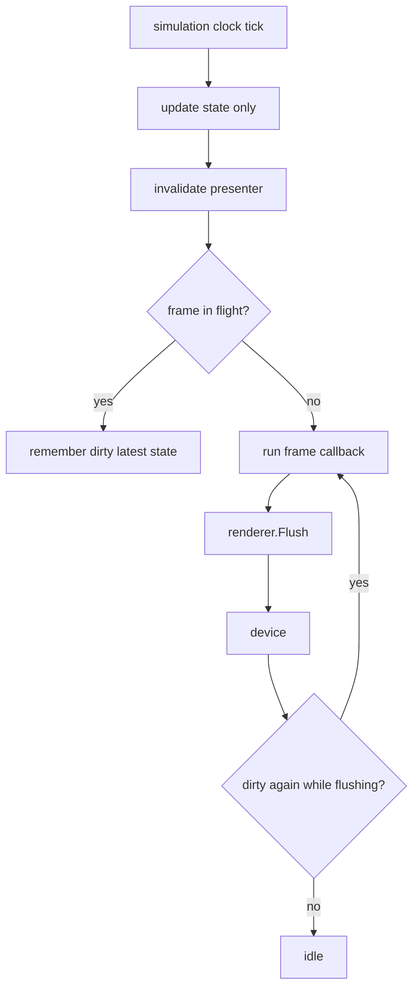

# Implementation plan for simulation-paced state with flush-gated presentation

## Executive summary

The current full-page cyb-ito scene uses the wrong control flow for a slow hardware-backed renderer. Today, the animation loop drives both simulation and rendering:

```javascript
anim.loop(1400, t => {
  phase.set(t);
  renderAll("loop");
});
```

Trace evidence has now shown that this causes the scene to rebuild itself dozens of times while one full-page flush is still in progress. That is not a tunable inconvenience. It is the wrong architecture for this output path.

The correct model is:

- **simulation state** should advance on its own clock,
- **presentation** should be gated by output readiness,
- only **one frame** should be in flight at a time,
- and repeated invalidations while a frame is in flight should collapse into **one future present of the latest state**.

This ticket defines that architecture and implements it without preserving backwards compatibility. That is intentional: we are still trying to get the single cyb-ito full-page path right, and keeping the old presentation model alive would only blur the fix.

## Problem statement

The current trace evidence established the following:

- the scene-global animation loop is the dominant source of rebuild calls,
- a non-empty full-page flush often has tens of rebuilds behind it,
- one traced run showed an average of about `33.6` rebuilds per non-empty flush,
- long flushes can contain many `loop.tick` and `renderAll.begin/end` pairs between `go.flush.begin` and `go.flush.end`.

This means the scene is currently an over-eager producer. The output path cannot keep up, but the simulation/rendering code continues to produce new full-page frames anyway.

## Correct mental model

We want to replace this:



with this:



The key ideas are:

- **simulation** is not the same as **presentation**
- not every simulation tick deserves a rendered frame
- stale intermediate frames should be dropped
- the next presented frame should reflect the **latest** simulation state available when the output path is ready

## What changes and what does not

### What changes

- Full-page rendering is no longer triggered directly by `anim.loop`.
- Rendering becomes a presenter-owned step.
- The live runner stops using a naive periodic flush ticker as the primary full-page presentation policy.
- A new JS-facing presentation API is introduced for the single intended model.

### What does not change

- goja remains owner-thread-only.
- transport policy remains in Go.
- rendering still happens through retained surfaces and `renderer.Flush()`.
- simulation time still comes from a clock, not from device flush acknowledgements.

## Proposed runtime architecture

### 1. Introduce a presentation runtime

Add a new pure-Go runtime, tentatively:

- `runtime/present/`

Responsibilities:

- hold one registered frame callback,
- track whether presentation is dirty,
- ensure at most one render/flush sequence is active,
- coalesce repeated invalidations while busy,
- immediately schedule the next present if dirty again after the current flush completes.

### 2. Introduce a JS presentation module

Add a new module, tentatively:

- `loupedeck/present`

Minimal API:

```javascript
const present = require("loupedeck/present");

present.onFrame(reason => {
  renderAll(reason || "present");
});

present.invalidate("initial");
present.invalidate("loop");
present.invalidate("T3");
```

The point of this API is to separate:

- **state changes** → `present.invalidate(reason)`
- **frame construction** → `present.onFrame(fn)`

### 3. Live runner wires the presenter to JS + renderer

`cmd/loupe-js-live/main.go` should:

- create the presenter runtime,
- install the JS frame callback via owner-thread settlement,
- give the presenter a flush callback that calls `renderer.Flush()`,
- and start the presenter loop.

After that, the presenter becomes the gatekeeper:

- if dirty and idle, render+flush one frame
- if dirty while busy, remember only that the latest state needs another frame

### 4. The scene stops rendering from `anim.loop`

The full-page scene should change from:

```javascript
anim.loop(1400, t => {
  phase.set(t);
  renderAll("loop");
});
```

to something like:

```javascript
const present = require("loupedeck/present");

present.onFrame(reason => {
  renderAll(reason || "present");
});

present.invalidate("initial");

anim.loop(1400, t => {
  phase.set(t);
  present.invalidate("loop");
});
```

Input paths should also invalidate the presenter rather than calling `renderAll` directly.

## Why this is the correct model

### Reason 1: it preserves correct simulation

The animation clock keeps advancing `phase` independent of hardware flush speed.

That means:

- the scene state is always current,
- time-based animation logic remains correct,
- and the next presented frame can use the latest state.

### Reason 2: it drops stale frames naturally

If ten simulation ticks happen while one long flush is in progress, the presenter does not need to render ten extra intermediate frames. It only needs to render the newest state once the current flush finishes.

### Reason 3: it matches how slow-output systems usually work

For expensive or slow outputs, common patterns are:

- one-frame-in-flight,
- latest-state wins,
- invalidation coalescing,
- render on present readiness.

The current model is the unusual one, not the proposed one.

## Forward-only decision: no backwards compatibility

This ticket is intentionally not preserving backwards compatibility in the presentation model.

That means:

- we are free to change the live runner to treat flush-gated presentation as the intended path,
- we are free to introduce a new required module/API for the cyb-ito scene,
- and we are not going to carry the old loop-driven whole-frame redraw model as an equal first-class path.

This is acceptable because the current goal is not a stable external API. The goal is to get the full-page cyb-ito runtime correct on hardware.

## Detailed implementation phases

### Phase A: ticket plan and reproducibility setup

- write this design doc
- write tasks and diary
- store the concrete commands/scripts used in the ticket `scripts/` directory

### Phase B: pure-Go presenter runtime

Create:

- `runtime/present/runtime.go`
- `runtime/present/runtime_test.go`

Features:

- register render callback
- register flush callback
- invalidate(reason)
- at-most-one render/flush in flight
- coalesced dirty state while busy
- close/shutdown behavior

### Phase C: environment + JS binding

Add to:

- `runtime/js/env/env.go`
- `runtime/js/runtime.go`
- `runtime/js/module_present/module.go`
- `runtime/js/runtime_test.go`

Features:

- environment owns the presenter runtime
- JS can register `onFrame(fn)`
- JS can call `invalidate(reason)`
- tests prove JS callback execution and invalidation coalescing semantics

### Phase D: live-runner refactor

Update:

- `cmd/loupe-js-live/main.go`

Changes:

- stop using the current periodic flush ticker as the main presentation driver for the intended full-page path
- wire presenter render callback → JS `onFrame`
- wire presenter flush callback → `renderer.Flush()`
- preserve current stats/tracing where possible
- add presentation trace breadcrumbs if useful:
  - `go.present.invalidate`
  - `go.present.begin`
  - `go.present.end`

### Phase E: migrate the full-page cyb-ito scene

Update:

- `examples/js/10-cyb-ito-full-page-all12.js`

Changes:

- use `loupedeck/present`
- remove direct `renderAll("loop")` from the animation loop
- make loop update state and invalidate presenter only
- make input update state and invalidate presenter only
- keep `renderAll(...)` as the frame-construction function used by `present.onFrame(...)`

### Phase F: trace/measurement validation

Run the new model on hardware and compare against the old trace baseline.

Primary success criteria:

- rebuilds-per-non-empty-flush should drop dramatically
- there should no longer be dozens of `renderAll.begin/end` pairs inside one long flush interval
- state should still visibly animate

## Expected trace changes after the refactor

### Before

Typical old trace shape:

```text
loop.tick
renderAll.begin
renderAll.end
loop.tick
renderAll.begin
renderAll.end
loop.tick
renderAll.begin
renderAll.end
...
go.flush.begin
go.flush.end ops=1 elapsedMs=1749.54
```

### After

Expected new trace shape:

```text
loop.tick
present.invalidate reason=loop
go.present.begin
scene.renderAll.begin reason=loop
scene.renderAll.end reason=loop
go.present.end ops=1 elapsedMs=...

loop.tick
present.invalidate reason=loop
loop.tick
present.invalidate reason=loop
loop.tick
present.invalidate reason=loop
go.present.begin
scene.renderAll.begin reason=loop
scene.renderAll.end reason=loop
go.present.end ops=1 elapsedMs=...
```

The crucial difference is that repeated simulation ticks during a busy flush should collapse into one later present, not trigger many full-page rebuilds immediately.

## Expected quantitative outcome

We should not promise a perfect number, but we should expect:

- rebuilds-per-flush far lower than the current traced average of `33.6`
- likely much closer to `1` or low single digits in steady state
- trace buckets no longer dominated by dozens or hundreds of rebuilds inside a single flush interval

## Risks

### Risk 1: animation still looks too slow

That would mean the flush path itself is still the bottleneck. But that would now be an honest presentation bottleneck, not an architectural misuse of the simulation loop.

### Risk 2: presenter semantics are too generic or too complicated

We should keep the API minimal. This is not a general scene scheduler yet. It is a one-frame-in-flight presenter for the current full-page runtime.

### Risk 3: old example assumptions break

Accepted. This ticket is explicitly forward-only and not preserving backwards compatibility.

## Working rules

- Do not call full-page `renderAll(...)` directly from `anim.loop` anymore.
- Do not couple simulation cadence to device flush completion.
- Do not allow more than one render/flush sequence in flight.
- Do coalesce repeated invalidations into one later present of the latest state.
- Treat the presenter as the owner of frame production.

## Immediate next step after implementation

Once the presenter path is implemented, rerun the no-input trace and compare directly against:

- `/tmp/loupe-cyb-ito-full10-trace-1776025944.log`

The main question will be simple:

> Did rebuilds-per-flush collapse to near `1`, or are we still generating excessive full-page rebuild work?
