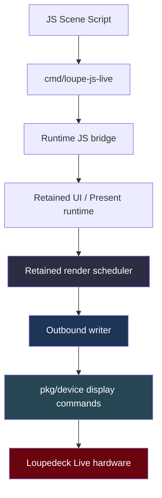
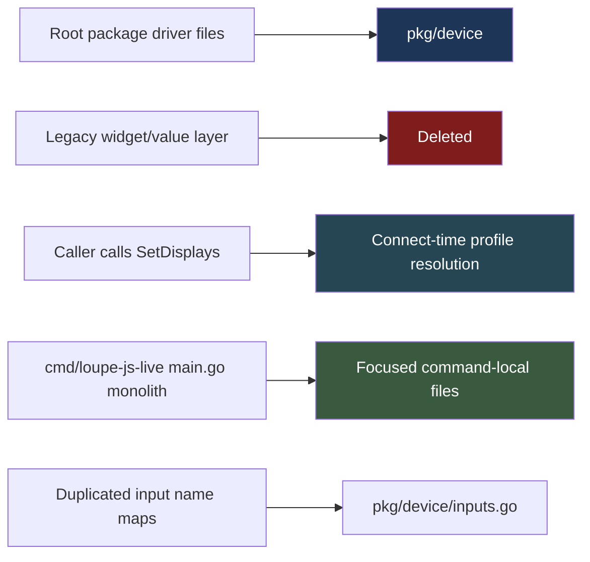

# Project Report - Cleanup and Performance

This report captures the recent cleanup and architectural simplification work in the local Loupedeck repository, with a particular focus on the `LOUPE-008` cleanup slice and the later post-hoc performance investigation that grew into `LOUPE-013`. The repository started this phase as a working but structurally uneven codebase with too much driver code at the repo root, a dead widget/value stack still hanging around, and a live runner that had accreted too much responsibility into one file.

The most useful way to think about this phase is that it had two distinct parts. The first part was **structural cleanup**: delete old abstractions, move the driver into `pkg/device`, centralize connect-time device profiling, and split `cmd/loupe-js-live` into focused files. The second part was **measurement after cleanup**: once the architecture was cleaner, it became possible to see more clearly where perceived slowness in the JS scenes was coming from, especially in `cyb-os-tiles`.

> [!summary]
> This cleanup phase had three durable outcomes:
> 1. the repository now has a much cleaner package shape, centered on `pkg/device`, `runtime/`, and focused `cmd/` binaries rather than root-level driver sprawl
> 2. `cmd/loupe-js-live` is no longer a monolith, and connect-time device profile resolution now returns a fully initialized device instead of forcing callers to remember `SetDisplays()`
> 3. post-hoc performance measurement showed that the raw hardware path is stronger than the default live-runner path, and that the retained render scheduler's default `40ms` flush interval imposes an important ~`25 FPS` ceiling before scene-specific costs are even considered

## Why this report exists

This repository is a hardware-facing Go + JavaScript environment for driving Loupedeck devices, especially the Loupedeck Live, from a retained runtime instead of only from one-off imperative demos. The broad project direction is to support rich device-native interfaces, retained UI composition, and procedural JS scenes while still keeping one foot in a lower-level package that can speak the real serial/WebSocket protocol reliably.

That means the project has to do two jobs at once:

- provide a clean reusable hardware driver layer
- provide a higher-level live runtime that is pleasant to experiment with from JavaScript

The cleanup work described here was necessary because the old structure blurred those responsibilities. Too much hardware-facing code was still living in root files, older abstractions were lingering after newer runtime layers had become the real architecture, and the runner binaries were carrying both current logic and dead compatibility baggage.

## Current project status

The repository is in a much better architectural state than it was at the start of this work.

What is now materially better:

- the device driver code lives under `pkg/device/`
- the legacy widget/value stack has been aggressively deleted instead of preserved for compatibility
- device profiles are resolved during connect, so callers get a properly initialized device
- canonical input naming/parsing now lives in one place
- `cmd/loupe-js-live` has been split into focused command-local files
- the explicit `--device /dev/ttyACM0` metadata regression was fixed
- `cmd/loupe-js-live` now exposes `--flush-interval`, making retained-render cadence tunable during investigation

What is still actively evolving:

- the retained JS runtime's actual scene-performance characteristics on hardware
- the best cadence strategy for multi-display scenes such as `cyb-os-tiles`
- whether the live runner should expose more scheduler controls or even a raw-mode / no-scheduler path
- whether future work should introduce a more explicit frame-pipeline or latest-frame-wins upload model

## Project shape

At a high level, the repository now looks much more like a conventional layered Go project:

1. **device package**
   - serial/WebSocket connect
   - message send/write
   - display abstractions
   - device profile resolution
   - event subscriptions
2. **runtime package tree**
   - retained UI model
   - JS runtime bridge
   - rendering and presentation infrastructure
3. **command binaries**
   - live JS runner
   - benchmark command
   - SVG/demo utilities
4. **ticket documentation**
   - `ttmp/` workspaces with design docs, tasks, changelogs, and implementation diaries

The key cleanup decision was to treat `runtime/` as the “real” architecture and stop pretending the older root-level package shape was the right long-term boundary.

## Architecture



A useful mental model is that the repository has two different performance and correctness worlds:

- a **raw device world**, where commands are pushed directly through the writer and the main question is what the hardware/protocol can sustain
- a **retained scene world**, where invalidation, flush cadence, composition cost, and scene structure all affect the visible result before the writer ever becomes the limiting factor

The cleanup work improved the boundary between those worlds. The post-hoc performance work then made the remaining gap measurable instead of hand-wavy.

## Cleanup work completed

### 1. Moved the driver into `pkg/device`

One explicit goal of this cleanup was to get rid of root-level `.go` files as the home of the real hardware driver. The repository now places that code under `pkg/device/`, which is a much saner boundary for code that is genuinely reusable across multiple commands.

This was not just cosmetic. Moving the driver into `pkg/device` made it easier to see which parts of the codebase are device/package concerns versus runtime/UI concerns.

### 2. Deleted the obsolete widget/value stack

The repository had accumulated a dead or near-dead layer of older abstractions such as:

- `displayknob.go`
- `intknob.go`
- `multibutton.go`
- `touchdials.go`
- `watchedint.go`

Those abstractions were not the future architecture. The retained runtime and JS path were. The cleanup therefore took the intentionally aggressive approach of deleting them instead of carrying compatibility shims forward.

This same attitude also removed the obsolete `cmd/loupe-feature-tester` binary and old tests tied to the removed stack.

### 3. Switched device initialization to connect-time profile resolution

One of the most important correctness improvements was changing device connect so that it resolves the device profile during connection rather than returning a half-initialized device that callers must finish manually.

That led to:

- `pkg/device/profile.go`
- `pkg/device/profile_test.go`
- connect-time display/profile setup in `pkg/device/connect.go`
- removal of manual `SetDisplays()` calls from callers

This was a meaningful cleanup because it removed a real footgun. The caller no longer has to remember to finish device setup after connect. The device package itself now owns that responsibility.

### 4. Canonicalized input naming and parsing

Button, knob, and touch naming logic had drifted into multiple places. That duplication was removed and replaced with canonical naming/parsing helpers in `pkg/device/inputs.go`, with the JS module and live runner now depending on that single source of truth.

This is not a flashy change, but it is exactly the kind of small structural correction that pays off later: fewer duplicated maps, less naming drift, and fewer “almost the same” parsing rules scattered across the repo.

### 5. Decomposed `cmd/loupe-js-live`

The live runner had become too monolithic. Rather than inventing a brand new shared package prematurely, the cleanup chose a narrower and more pragmatic move: split the command into focused command-local files.

That yielded:

- `cmd/loupe-js-live/main.go`
- `cmd/loupe-js-live/options.go`
- `cmd/loupe-js-live/run.go`
- `cmd/loupe-js-live/stats.go`
- `cmd/loupe-js-live/logging.go`
- `cmd/loupe-js-live/cleanup.go`

This is one of the most important maintainability wins in the whole slice. The live runner is still one command, but it is no longer one giant file.

### 6. Fixed explicit device-path connect metadata

After connect-time profile resolution became stricter, explicit `--device /dev/ttyACM0` runs started failing because manual-path connects were not carrying product metadata through. That regression was fixed by teaching `ConnectSerialPath()` to recover metadata from enumerated serial-port details and by refreshing metadata once more before profile resolution if necessary.

This was a good example of cleanup exposing a hidden assumption: the more correct initialization logic immediately made older manual-path shortcuts insufficient.

## Implementation details

The most important technical shift in this cleanup was moving from a “caller assembles the device correctly after connect” model to a “connect returns a real device” model.

At a structural level, the cleanup now looks like this:



A simplified view of the connect path after cleanup is:

```text
open serial/WebSocket path
  -> recover vendor/product metadata
  -> resolve device profile
  -> apply display layout + model
  -> construct writer and optional render scheduler
  -> return fully initialized Loupedeck object
```

That seems obvious in hindsight, but the repository previously had a weaker version of this flow. The cleaner version matters because display layout, profile, and model are not optional metadata. They shape the meaning of everything above the driver layer.

The `cmd/loupe-js-live` split follows the same philosophy. Instead of one large `main.go` that silently mixes:

- flag parsing
- connect setup
- runtime creation
- stats emission
- cleanup
- exit handling

those responsibilities are now separated into named files. That makes the runner easier to reason about without over-abstracting it.

## Important project docs

The core cleanup slice is documented in:

- `/home/manuel/code/wesen/2026-04-11--loupedeck-test/ttmp/2026/04/12/LOUPE-008--codebase-architecture-analysis-package-reorganization-and-complexity-assessment/`

The post-hoc performance investigation is documented in:

- `/home/manuel/code/wesen/2026-04-11--loupedeck-test/ttmp/2026/04/13/LOUPE-013--cyb-os-tiles-framerate-investigation-and-raw-transport-benchmark-refresh/`

Important repo files touched or clarified by this work include:

- `/home/manuel/code/wesen/2026-04-11--loupedeck-test/pkg/device/connect.go`
- `/home/manuel/code/wesen/2026-04-11--loupedeck-test/pkg/device/dialer.go`
- `/home/manuel/code/wesen/2026-04-11--loupedeck-test/pkg/device/profile.go`
- `/home/manuel/code/wesen/2026-04-11--loupedeck-test/pkg/device/inputs.go`
- `/home/manuel/code/wesen/2026-04-11--loupedeck-test/pkg/device/renderer.go`
- `/home/manuel/code/wesen/2026-04-11--loupedeck-test/cmd/loupe-js-live/options.go`
- `/home/manuel/code/wesen/2026-04-11--loupedeck-test/cmd/loupe-js-live/run.go`
- `/home/manuel/code/wesen/2026-04-11--loupedeck-test/cmd/loupe-fps-bench/main.go`
- `/home/manuel/code/wesen/2026-04-11--loupedeck-test/examples/js/11-cyb-os-tiles.js`

## Performance measurement, post-hoc

The most interesting thing about the performance work is that it only became legible **after** the cleanup. Once the repo shape was cleaner and the live runner had better stats paths, it was much easier to separate three different questions:

1. what the raw hardware path can do
2. what the default live runner chooses to do
3. what a specific scene such as `cyb-os-tiles` costs on top of that

### Raw benchmark baseline

The fresh `loupe-fps-bench` rerun showed that the raw writer/device path on the current tree is still fairly strong:

- full-screen main display stable to about **36 FPS**
- single `90x90` region stable to about **320 FPS**
- mixed 12-button bank stable to about **288 total FPS**

This matters because it falsifies the simplest bad explanation. The hardware path is not inherently “only about 10 FPS.”

### What `cyb-os-tiles` revealed

The `cyb-os-tiles` scene ran successfully on hardware, but it felt slower than expected. Stats showed that in its normal three-display form it was only landing in the rough **10–15 FPS** range when using the live runner.

A temporary main-only variant improved that into the rough **22–24 FPS** range. That made it clear that the number and shape of display updates mattered a lot.

At first glance, that looked like “three draws per frame are expensive,” which is true, but it was not the whole story.

### The key post-hoc finding: the live runner has a default scheduler cap

The dedicated JS path probes made the next layer visible. The live runner uses the retained render scheduler in `pkg/device/renderer.go`, and the default render options are:

```go
var DefaultRenderOptions = RenderOptions{
    FlushInterval: 40 * time.Millisecond,
    QueueSize:     256,
}
```

That means the default live-runner path has an approximate ceiling near:

- **25 FPS**

before any scene-specific cost is added.

That explains why the earlier main-only `cyb-os-tiles` experiment landed around `22–24 FPS`: it was already pressing close to the retained-scheduler ceiling.

### JS path probes

The dedicated JS probes were useful because they tested simpler shapes than `cyb-os-tiles` itself:

- main-only probe
- three-display probe
- main-fast / side-slow probe
- presenter-driven self-invalidating variants

Under the default `40ms` interval, the writer-layer results were very consistent:

- main-only probe: about **50 commands / 2s** → about **25 FPS**
- three-display probe: about **150 commands / 2s** → about **25 frame-equivalents/sec**

That showed the scheduler cadence quite cleanly.

### Exposing `--flush-interval`

To make this tunable instead of implicit, `cmd/loupe-js-live` was updated to expose:

```bash
--flush-interval 40ms
```

That matters because it turns a hidden retained-runtime policy into an explicit measurement and tuning knob.

When the present-driven probes were rerun at `20ms`, the writer-facing throughput moved upward:

- main-only present-driven probe rose from about **25 FPS** to about **35–36 FPS**
- three-display present-driven probe rose only modestly in frame-equivalent terms, because it still pays for three display commands per frame

This is a very useful result. It means the scheduler cap was real, but it also means the three-display shape still has meaningful additional cost after the cap is relaxed.

## What the benchmark does *not* measure

One subtle but important point is that `cmd/loupe-fps-bench` does **not** currently benchmark a real left+main+right three-display scene frame. It benchmarks only main-display workloads:

- `360x270` main display full-screen
- `90x90` main-display region updates
- mixed-button updates on the main display

That is why the custom JS path probes were worth writing. They measure the actual live-runner path that multi-display scenes use.

## Current understanding of the bottleneck

The current best explanation for the `cyb-os-tiles` slow feel is layered:

1. **raw hardware path** is stronger than the scene suggests
2. **default live-runner retained scheduler** caps normal scene flushing around `25 FPS`
3. **three-display scene shape** adds command and composition cost on top of that
4. **`cyb-os-tiles` itself** has additional scene-generation and display-update overhead that pushes it below the scheduler ceiling in its current form

That is a much better explanation than either of the two naive extremes:

- “JavaScript is just slow”
- “the serial path is just too slow”

The reality is more layered and therefore more actionable.

## Open questions

- Should the live runner expose even more scheduler controls, such as a no-scheduler / raw mode?
- Should the default `40ms` flush interval be lowered?
- Would `cyb-os-tiles` become acceptably smooth if side displays updated at a lower cadence while `main` updated every frame?
- Should a future frame pipeline use a latest-frame-wins double-buffered upload model?
- On devices that support an `all` display, should scene code target one large surface more explicitly while older devices continue splitting into `left` / `main` / `right`?

## Near-term next steps

The most sensible next experiments are now clearer than they were before:

- run `cyb-os-tiles` itself at `--flush-interval 20ms` and `10ms`
- test a real `cyb-os-tiles` variant where `left` and `right` redraw less often than `main`
- compare the visual and writer-level results against the simpler probes
- decide whether `--flush-interval` should remain mainly a tuning knob or become part of the normal live-runner UX

## Project working rule

> [!important]
> Keep raw hardware throughput, retained-runner cadence, and scene-specific cost as separate measurements.
> Do not explain visible scene performance with only one of those layers.
